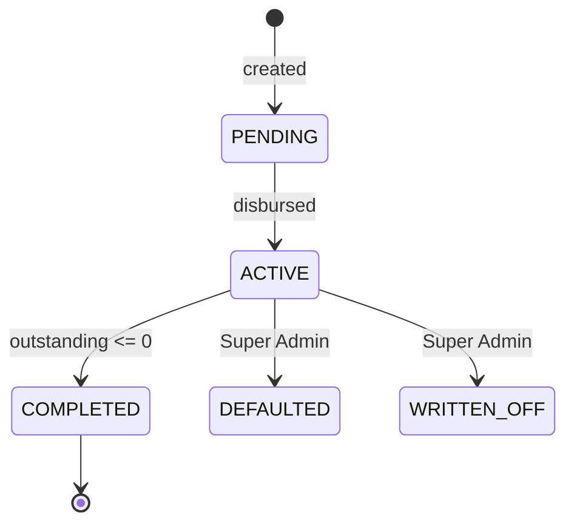

# M05 — Accounts

**Purpose:** the loan. Creation, derivation, schedule, lifecycle, completion.

**Source:** PDF §8, §9, §13, §27. Rules: BR-01, BR-01a, BR-03…BR-07.

> "Account" means **a loan**. The database entity is `account_loan` because `account` belongs to Better Auth. See the [glossary](../../00-overview/glossary.md#money).

---

## Scope

**In:** account creation and validation, profit derivation, schedule generation and regeneration, status lifecycle, completion detection, target-date recomputation.

**Out:** collection entry (M07), ledger postings (M09), working-day arithmetic (M06 — consumed, not owned).

---

## Owned entities

`account_loan` · `account_schedule`

---

## Creation

Admin enters `A` (account amount), `I` (invested), `D` (one instalment), `N` (term, default 100), a **collection frequency** and a disbursement date. **`P = A − I` is derived and never editable** (BR-01).

The frequency is `DAILY` (the default), `WEEKLY` or `MONTHLY` (BR-04). It renames the two fields counted in it — the form reads "Weekly amount (₹)" and "Term (weeks)" — because `N` counts **instalments** at the chosen cadence. It changes nothing else: the validation below is the same check at every frequency.

Validation — all enforced as database check constraints, not only in the form:

| Constraint       | Message                                                                                                         |
| ---------------- | --------------------------------------------------------------------------------------------------------------- |
| `I < A`          | Profit cannot be zero or negative                                                                               |
| `D ≤ A`          | One instalment cannot exceed the account                                                                        |
| `D × N ≥ A`      | The term cannot clear the account — worded in the frequency's own unit ("₹500 × 20 weeks cannot clear ₹10,000") |
| `A, I, D, N > 0` |                                                                                                                 |

**Multiple concurrent accounts per customer are permitted** (BR-01a). No constraint restricts this.

### The form derives live

Profit, first collection date, target completion date and a full schedule preview update as the Admin types. Mistakes surface before saving, not after — and after disbursement the amounts are immutable, so there is no second chance.

### Mid-term account creation

A **past disbursement date is a supported, expected case.** There is no data import, so every customer entered at launch is already partway through their term.

When the disbursement date precedes today, creation additionally takes a **collected-to-date** amount. The account is created, the schedule is generated from the original disbursement date, slots up to the collected amount are marked collected, and the ledger receives an opening disbursement plus a catch-up posting so it balances from the first day.

> **The collected figure is taken from the customer's paper collection note, never inferred as `days × dailyAmount`.** Any customer who has ever underpaid will not match that formula, and an account seeded with an inflated collected total completes early and leaves money uncollected — silently, and permanently.

An account created this way must behave **identically** to one created from day zero: same target-date computation (BR-06), same expected-amount capping (BR-07), same completion rule (BR-05). This is PRD release gate 6, and it is a gate because getting it wrong makes every customer wrong from the first morning.

---

## Schedule

`ceil(A ÷ D)` slots, laid on the dates the account's frequency gives from day 0 (BR-03, BR-04) — the count comes from the balance, not from `N`. Each slot expects `min(D, remaining)`, so every slot expects `D` except the last, which takes the remainder, and the schedule sums exactly to `A`.

Where the slots fall is the only thing the frequency decides: consecutive working days for a `DAILY` account, every seventh calendar day for a `WEEKLY` one, the same day of each month for a `MONTHLY` one, with an anchor landing on a Sunday or holiday moving forward to the next working day and the anchors after it still measured from day 0. BR-04 has the table and the worked example.

> **Uneven example:** `A = 10,000`, `D = 150`. Slots 1–66 expect ₹150 (₹9,900); slot 67 expects ₹100. The customer pays ₹100 on the final day, not ₹150.

> ⚠️ **Corrected during implementation.** This section previously said `N` slots with the last expecting `A − D × (N − 1)`, which BR-04 had already replaced: with `N = 100` and `D = 150` it gives a final slot of −₹4,850.

**Implemented in `packages/domain`** (`src/schedule/`). One function, `generateSchedule({ outstanding, dailyAmount, after, frequency, holidays, firstSequence })`, produces both the initial schedule (`outstanding = A`, `after = disbursementDate`, `firstSequence = 1`) and every regenerated tail. `targetCompletionDate` is the last slot's due date, or `null` when nothing is outstanding. Amounts are `Decimal` in and out; the slot count is integer division on paise, so no decimal precision setting is involved.

`frequency` is **required, with no default**, and the due dates come from `collectionDueDates` in `src/schedule/frequency.ts`. Defaulting it would be the dangerous option: a tail regenerated after a collection would quietly put a weekly customer back on a daily round, and nothing would fail until the Junior arrived at the wrong door. Making it required turns that into a compile error at every call site.

### The schedule is a plan, and its tail is regenerable

After every collection, `PENDING` slots are regenerated from the current outstanding (BR-06). `COLLECTED` slots are immutable and never touched.

```
remainingDays = ceil(outstanding / D)
targetCompletionDate = the remainingDays-th working day from the next collection day
```

> Regenerating rather than projecting separately means there is exactly one representation of "what is expected and when". A separate projection would be a second source of truth that could disagree with the schedule the Junior actually sees.

---

## Expected amount is capped

```
expected = min(D, outstanding)
```

(BR-07.) A customer with ₹80 left is shown ₹80, not ₹100. This is what prevents over-collection and a refund obligation, and it needs no special case for the final day.

---

## Lifecycle



`isOverdue` is a **flag on `ACTIVE`**, not a status (BR-05) — an overdue account is still active and still collecting. Set the day after `targetCompletionDate` passes with outstanding remaining, with no grace period (open question 3).

| Status        | Collection | Set by                         |
| ------------- | ---------- | ------------------------------ |
| `PENDING`     | No         | Creation                       |
| `ACTIVE`      | Yes        | Disbursement                   |
| `COMPLETED`   | No         | Automatic on `outstanding ≤ 0` |
| `DEFAULTED`   | No         | Super Admin, reason mandatory  |
| `WRITTEN_OFF` | No         | Super Admin, reason mandatory  |

> Write-off is Super Admin only because it destroys receivable value. It must not be an action an Admin can take to tidy up a difficult account.

---

## Completion

On `outstanding ≤ 0`, within one transaction: status → `COMPLETED`, `actualCompletionDate` set to that business date, remaining slots → `CANCELLED`, and `account.completed` emitted for M10 (§12).

Completion is **balance-driven, not day-driven** (BR-05). Day 100 is a target.

---

## Denormalised balances

`collectedAmount` and `outstandingAmount` are caches, updated in the same transaction as each collection and **verified nightly against the ledger** (M14, US-095).

> The ledger is the source of truth. These exist because the Junior's route screen and every dashboard need outstanding on every read, and recomputing from full history does not scale to 1,500 accounts. The nightly reconciliation is what makes a cache acceptable rather than a liability — without it, drift is silent and compounds.

---

## Operations

| Operation                    | Actor                                        |
| ---------------------------- | -------------------------------------------- |
| Create                       | Admin+                                       |
| Update terms                 | Admin+, **pre-disbursement only**            |
| Disburse                     | Admin+                                       |
| Mark defaulted / written off | Super Admin                                  |
| View, view schedule          | Admin+, Senior (own line), Junior (assigned) |

---

## Events

> **As built: no event bus exists** (decided 2026-09-15, [M13](M13-audit.md#as-built)). The events below name what _would_ be published; nothing publishes or consumes them. What they were for is covered directly: the audit log records every change with its actor, dashboards read state from the database, and a notification is raised only where [M10](M10-notifications.md#categories-and-events) catalogues one and a service calls `EventNotices`.

**Emitted:** `account.created`, `account.disbursed` (→ M09 ledger), `account.completed` (→ M10), `account.overdue` (→ M10), `account.written_off` (→ M09).

**Consumed:** `collection.confirmed` (M07) → recompute balances, regenerate tail, check completion. `holiday.declared` (M06) → shift affected pending slots (as built: `HolidayService` shifts them directly in the declaring transaction, [M06 as built](M06-working-calendar.md#as-built--holidays-us-093-2026-09-17)).

---

## As built

In `apps/api/src/accounts/`, served through `packages/contracts/src/account.contract.ts`. Status is in the [backlog](../../06-delivery/backlog.md).

| Endpoint                                            | Permission             | Refusals                                                                                                                                                      |
| --------------------------------------------------- | ---------------------- | ------------------------------------------------------------------------------------------------------------------------------------------------------------- |
| `POST /api/accounts/preview`                        | `account.create`       | `400` (BR-01, at the field), `404` customer, `422` as below. Saves nothing                                                                                    |
| `POST /api/accounts`                                | `account.create`       | `422 CUSTOMER_BLACKLISTED`, `LINE_INACTIVE`, `COLLECTED_TO_DATE_REQUIRED`, `COLLECTED_TO_DATE_NOT_ALLOWED`; `disburse: true` also disburses a day-one account |
| `PATCH /api/accounts/:accountId`                    | `account.updateTerms`  | `400` (BR-01, at the field), `404`, `422 ACCOUNT_NOT_PENDING`, `422 DISBURSEMENT_DATE_IN_PAST`                                                                |
| `POST /api/accounts/:accountId/disbursement`        | `account.disburse`     | `404`, `422 ACCOUNT_NOT_PENDING`, `422 DISBURSEMENT_DATE_IN_FUTURE`                                                                                           |
| `POST /api/accounts/:accountId/closure`             | `account.close`        | `404`, `422 ACCOUNT_NOT_ACTIVE`; `400` without a reason. Super Admin only                                                                                     |
| `GET /api/accounts`, `GET /api/accounts/:accountId` | `account.view`         | `404` out of scope. `investedAmount` and `profitAmount` are `null` for a Junior                                                                               |
| `GET /api/accounts/:accountId/schedule`             | `account.viewSchedule` | `404`                                                                                                                                                         |

**Validation.** BR-01's rules are checked in the contract, in US-030's words: "must be below the account amount — profit cannot be zero or negative", and "50 × 100 days cannot clear 10,000" — with the unit following the frequency, so a weekly account reads "50 × 20 weeks cannot clear 10,000". The form and the API therefore give the same answer, and the database CHECKs repeat the rules.

**Schedule.** Creation stores the whole `generateSchedule` result. Holidays come from the `holiday` table: business-wide rows plus the customer's sector, resolved once per call. The preview endpoint uses the same code path, so what the Admin sees is what is stored.

**Collection frequency (BR-04, US-030b, 2026-09-23).** `collectionFrequency` is part of the terms, defaulting to `DAILY` so every caller written before it existed is unchanged, and it is carried into `generateSchedule`, `planMidTermSchedule` (US-030a), the disbursement-day regeneration, the regenerated tail in `AccountSettlement` and the holiday shift.

- `termDays` is **the number of instalments**, in units of the cadence. Under `DAILY` that is days, which is what it always meant, so no stored row changed meaning. This is why BR-01's `D × N ≥ A` and its CHECK constraint needed no change.
- It is **immutable after disbursement**, enforced by the trigger `account_loan_frequency_immutable` alongside the one for `A` and `I`: changing it would move every remaining visit on an account whose dates the customer already has.
- It is correctable while `PENDING`, and the correction dialog carries the account's current value rather than letting the schema's default quietly return a weekly account to a daily round.
- The enum is written out in both `@repo/domain` and `@repo/contracts`, which may not import each other; `apps/api/test/accounts/collection-frequency.spec.ts` holds the two lists together.
- **Not done:** the seed dataset is still entirely daily, and the picker has had no browser pass.

**Scope** follows the customer's **current** line (`accountScope`), not `account_loan.lineId`. The line that collects a transferred customer sees their accounts.

**Codes** are `ACC-<creation year>-<n>`, where `n` comes from `account_code_seq` and never restarts (decided 2026-09-13).

**Disbursement** (US-032):

- The status change is a conditional update from `PENDING`, so a concurrent second disbursement is refused before it writes anything.
- The BR-18 posting goes through `LedgerService` in the same transaction.
- A pending account whose planned date has passed is disbursed today: its disbursement date moves, its schedule is regenerated, and the audit entry records both dates.

**Correcting terms before disbursement (US-030, 2026-09-20).** `PATCH /api/accounts/:accountId` takes the whole set of terms and checks them exactly as creation does (BR-01, in the contract). Only a `PENDING` account: after disbursement the amounts are immutable in the service and in the database (`constraints_account_lifecycle`), so this is the only window in which a typo can be fixed rather than written off.

- The plan is rebuilt by the same code creation uses, so the schedule, first collection date and target date cannot drift from a fresh account on those terms. The account code never changes.
- **A past disbursement date is refused** (`422 DISBURSEMENT_DATE_IN_PAST`): that is how a mid-term account is entered (US-030a), which needs a collected-to-date figure and posts to the ledger — a new account, not a correction.
- The customer is not editable here: an account on the wrong customer is a different account.
- The console shows **Correct terms** beside Disburse while the account is pending.

**Closing by hand (US-035, 2026-09-20).** `POST /api/accounts/:accountId/closure` takes `DEFAULTED` or `WRITTEN_OFF` and a mandatory reason, kept as `closureNote`. Super Admin only (`account.close`): a write-off destroys receivable value, and must not be a way for an Admin to tidy away a difficult account.

- Only an `ACTIVE` account can be closed (`422 ACCOUNT_NOT_ACTIVE`), and the status change is a conditional update as disbursement's is, so a second closure posts nothing.
- Remaining `PENDING` slots become `CANCELLED` and `isOverdue` clears — nothing more is expected. Answered slots are history and are untouched.
- **Only `WRITTEN_OFF` posts to the ledger** (decided 2026-09-20): it clears the outstanding and the unearned profit still held, carrying the difference to the new `WRITE_OFF_LOSS` account ([M09](M09-ledger.md#the-postings)). `DEFAULTED` stops collection and leaves the money owed, so a defaulted account keeps its receivable and can be written off later.
- The console shows a Close action on the account for a Super Admin, naming what each closure does before it happens.

**Mid-term accounts (US-030a, decided 2026-09-13).** A disbursement date before today makes a mid-term account.

- **Collected to date is required** (`422 COLLECTED_TO_DATE_REQUIRED`), and refused for today or later (`COLLECTED_TO_DATE_NOT_ALLOWED`).
- **Schedule:** `planMidTermSchedule` (domain) pays the original slots in order with the entered amount. Fully paid slots keep their dates as `COLLECTED`, and a slot paid in part is `PARTIAL`. No `MISSED` rows are invented. The rest of the balance is `generateSchedule`'s tail from the next working day after entry, so the account first appears on tomorrow's route, exactly as a day-one account collected down to the same outstanding would (release gate 6, a property test).
- **Account:** created `ACTIVE`, with `collectedAmount` and `outstandingAmount` set.
- **Ledger, in the same transaction:** the DISBURSEMENT is dated on the original disbursement date. One COLLECTION catch-up follows on the entry day: debit `CASH_AT_OFFICE` (money already back in the business), credit the receivable, and move `profitForCollection` from zero into earned profit. No collection rows are created for money paid before Rasi.
- **Preview** returns `kind`, collected, outstanding and the amount behind the original schedule.

Collected slots of a customer who paid ahead keep their original dates, which can fall after the entry day. They are marked `COLLECTED` and never appear on a route.

**Not built:**

- **Updating terms before disbursement.**
- **Completion, overdue and write-off** (US-033, US-035).
- **Events and notifications.**

---

## Risks

| Risk                                              | Mitigation                                                                    |
| ------------------------------------------------- | ----------------------------------------------------------------------------- |
| Cached balance drifts from the ledger             | Same-transaction updates plus nightly reconciliation with alerting            |
| Schedule regeneration touches collected slots     | Regeneration filters to `PENDING` only; covered by tests                      |
| Amounts edited after disbursement                 | Blocked at the service layer and by the permission matrix                     |
| Multi-account customers confuse balance reporting | Outstanding is always per account; customer-level is an explicit labelled sum |
