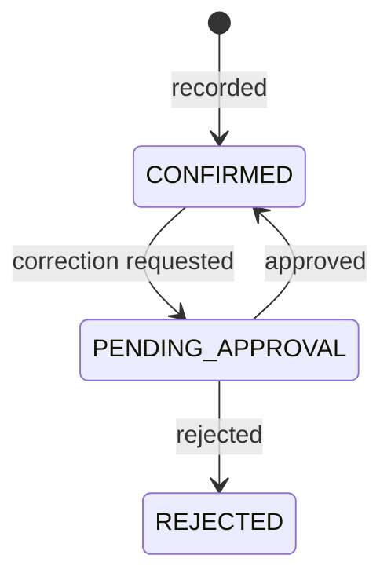

# M07 — Collections

**Purpose:** record money changing hands. The heart of the application.

**Source:** PDF §10, §11, §27. Rules: BR-07, BR-08, BR-09, BR-10, BR-13, BR-14, BR-15.

---

## Scope

**In:** the Junior's route, collection entry, variance classification, offline sync and idempotency, corrections and approvals, missed detection.

**Out:** cash reconciliation (M08), ledger postings (M09), schedule regeneration (M05).

---

## Owned entities

`collection` · `collection_approval` · `idempotency_key`

---

## Recording a collection

Only a **Junior** records collections, and only for their assigned customers.

> This is stricter than PDF Appendix A, which shows "View" for Admin and Super Admin. Recording is a statement that cash physically changed hands, and only the person at the door can truthfully make it. An Admin fixing an error does so through the approval path, which leaves both records visible — not by recording a collection they did not take.

A collection always targets **one specific account** (BR-01a). `accountLoanId` is mandatory and never inferred from the customer.

### Four fields are frozen at write time

`lineId`, `collectedByUserId`, `expectedAmount`, `businessDate` — each a snapshot of a fact true when the money moved.

| Field | Why frozen |
| --- | --- |
| `lineId` | A customer transferring later must not rewrite two lines' history (BR-15) |
| `collectedByUserId` | Who collected, independent of who staffs the line today |
| `expectedAmount` | Not recomputable later — the account has progressed since |
| `businessDate` | Indexable, and immune to a future timezone policy change (BR-12) |

---

## Classification

`variance = amount − expectedAmount` (BR-08). **Exact match required for `CORRECT`** — no tolerance band.

| Condition | Class | Senior notified |
| --- | --- | --- |
| `variance = 0` | `CORRECT` | No |
| `variance < 0`, `amount > 0` | `LOW` | Alert |
| `variance > 0` | `EXTRA` | Warning |
| `amount = 0`, visited | `NO_PAYMENT` | Alert |
| No record on a due day | `MISSED` (schedule status) | Alert |

Classification is **computed and stored at write time**, not derived on read — the expected amount moves as the account progresses, so a later computation would not reproduce the value true on the day.

### Missed is not a collection status

A missed visit produces no collection row at all. `MISSED` lives on `account_schedule` and is set by a scheduled job **after the line closes** (BR-09) — a Junior collecting at 6pm has not missed anything at noon.

> Three states that must never be conflated: `MISSED` is staff failure, `NO_PAYMENT` is a customer signal, and a holiday is neither. Collapsing them would blame customers for staff absence, or fire a false alert for everyone at once.

---

## Offline

The hardest requirement in v1. Full design in [`../../02-architecture/offline-sync.md`](../../02-architecture/offline-sync.md).

| Requirement | Detail |
| --- | --- |
| Local save | Under 100 ms, **never blocked by network** |
| Idempotency key | UUID v4, generated **at record time**, before any network attempt |
| Replay | Same key returns the original result with `200`, not a conflict |
| Queue | IndexedDB outbox, drained by Background Sync |
| Route cache | Full route and balances available offline for 72 hours |
| Status | Three distinguishable states: saved on device, syncing, synced |

> The key must be generated when the collection is recorded, not when the request is dispatched. Generating it at send time means a retry after an ambiguous outcome carries a *new* key — precisely the duplicate the mechanism exists to prevent.
>
> The unique constraint on `idempotencyKey` is the enforcement point. Application-level duplicate checks cannot be made race-free against concurrent replays from the same device.

### Late sync reopens a closed day

A collection syncing after its line closed is accepted at its true business date; the day close reopens and recomputes; the Senior is notified (BR-16a).

> The alternative — posting it to the next day — keeps books stable but records a payment on a day the customer did not pay, breaking reconciliation against the paper note in their hand. Stable books are worth less than books that match reality.

---

## Corrections

**Collections are append-only.** No update path exists in the API (BR-14).

A correction inserts a **new** `ADJUSTMENT` row referencing the original via `adjustsCollectionId`. A reversal is an adjustment for the negative of the original. The balance is the sum of all confirmed rows; both records stay visible.

Approval: Senior for their own line, or Admin. **Self-approval is blocked regardless of role.**

> Append-only removes the risk structurally rather than relying on an audit log to catch it afterwards. In a cash business, the ability to silently change a past figure *is* the risk.

---

## The route screen

The most important screen in the application (see [personas](../../00-overview/personas.md#junior--the-collector)).

- Only customers with a slot due today, in visiting order
- Name, address, expected amount, outstanding
- **No invested amount or profit anywhere**
- Single-account case: one tap to confirm
- Multi-account case: customer as a group header, one row per account, **each confirming independently**

> The multi-account layout must look visibly different, not be a subtle variation. A customer handing over ₹250 against accounts expecting ₹100 and ₹150 requires an explicit split; a single combined field would be ambiguous and would corrupt both balances (US-042).

---

## Operations

| Operation | Actor |
| --- | --- |
| View today's route | Junior |
| Record collection | Junior, assigned customers only |
| Sync queued collections | Junior (automatic) |
| View collections | Admin+, Senior (own line), Junior (own entries) |
| Request correction | Junior (own), Senior (own line) |
| Approve correction | Senior (own line), Admin+ |
| Reverse a collection | Admin+ |

---

## Events

**Emitted:** `collection.confirmed` (→ M05 balances, M09 ledger, M08 tally, M10 alerts), `collection.adjusted`, `collection.correction_requested` (→ M10), `collection.missed` (→ M10).

**Consumed:** `day_close.closed` (M08) → run missed detection. `account.completed` (M05) → drop from future routes.

---

## Risks

| Risk | Mitigation |
| --- | --- |
| **Duplicate collections from replay** | Unique constraint on `idempotencyKey`, generated at record time |
| **Lost offline collections** | IndexedDB persistence, Background Sync, unsynced count always visible, sign-out blocked while queued |
| Junior mis-splits a multi-account payment | Explicit per-account entry; no combined field |
| Alert fatigue | Exact-match classification with no tolerance; missed detection deferred until after day close |
| Clock skew on device | `capturedAt` is device time and `syncedAt` is server time; business date derives from `capturedAt` but is validated against a plausible window and flagged if wildly divergent |
