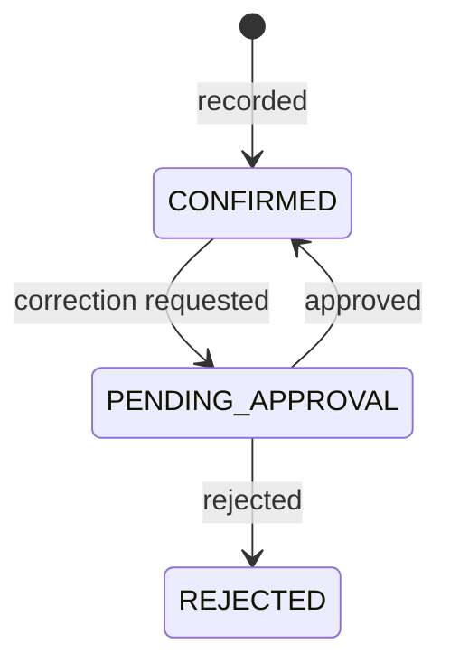

# M07 — Collections

**Purpose:** record money changing hands. The heart of the application.

**Source:** PDF §10, §11, §27. Rules: BR-07, BR-08, BR-09, BR-10, BR-13, BR-14, BR-15.

---

## Scope

**In:** the Junior's route, collection entry, variance classification, offline sync and idempotency, corrections and approvals, missed detection.

**Out:** cash reconciliation (M08), ledger postings (M09), schedule regeneration (M05).

---

## Owned entities

`collection` · `collection_approval` · `idempotency_key`

---

## Recording a collection

Only a **Junior** records collections, and only for their assigned customers.

> This is stricter than PDF Appendix A, which shows "View" for Admin and Super Admin. Recording is a statement that cash physically changed hands, and only the person at the door can truthfully make it. An Admin fixing an error does so through the approval path, which leaves both records visible — not by recording a collection they did not take.

A collection always targets **one specific account** (BR-01a). `accountLoanId` is mandatory and never inferred from the customer.

### Four fields are frozen at write time

`lineId`, `collectedByUserId`, `expectedAmount`, `businessDate` — each a snapshot of a fact true when the money moved.

| Field               | Why frozen                                                                |
| ------------------- | ------------------------------------------------------------------------- |
| `lineId`            | A customer transferring later must not rewrite two lines' history (BR-15) |
| `collectedByUserId` | Who collected, independent of who staffs the line today                   |
| `expectedAmount`    | Not recomputable later — the account has progressed since                 |
| `businessDate`      | Indexable, and immune to a future timezone policy change (BR-12)          |

---

## Classification

`variance = amount − expectedAmount` (BR-08). **Exact match required for `CORRECT`** — no tolerance band.

| Condition                    | Class                      | Senior notified |
| ---------------------------- | -------------------------- | --------------- |
| `amount = 0`, visited        | `NO_PAYMENT`               | Alert           |
| `variance = 0`, `amount > 0` | `CORRECT`                  | No              |
| `variance < 0`, `amount > 0` | `LOW`                      | Alert           |
| `variance > 0`, `amount > 0` | `EXTRA`                    | Warning         |
| No record on a due day       | `MISSED` (schedule status) | Alert           |

**`amount = 0` is decided first.** Otherwise a ₹0 visit against a ₹0 expectation would match both `CORRECT` and `NO_PAYMENT`. It is `NO_PAYMENT` — nothing was paid — which is also the only value `collection_classification_check` accepts. Adjustments are not classified.

Implemented as `classifyCollection({ amount, expectedAmount })` in `packages/domain` (`src/collection/variance.ts`), which returns the `variance` and `classification` to store.

Classification is **computed and stored at write time**, not derived on read — the expected amount moves as the account progresses, so a later computation would not reproduce the value true on the day.

### Missed is not a collection status

A missed visit produces no collection row at all. `MISSED` lives on `account_schedule` and is set by a scheduled job **after the line closes** (BR-09) — a Junior collecting at 6pm has not missed anything at noon.

> Three states that must never be conflated: `MISSED` is staff failure, `NO_PAYMENT` is a customer signal, and a holiday is neither. Collapsing them would blame customers for staff absence, or fire a false alert for everyone at once.

---

## Offline

The hardest requirement in v1. Full design in [`../../02-architecture/offline-sync.md`](../../02-architecture/offline-sync.md).

| Requirement     | Detail                                                            |
| --------------- | ----------------------------------------------------------------- |
| Local save      | Under 100 ms, **never blocked by network**                        |
| Idempotency key | UUID v4, generated **at record time**, before any network attempt |
| Replay          | Same key returns the original result with `200`, not a conflict   |
| Queue           | IndexedDB outbox, drained by Background Sync                      |
| Route cache     | Full route and balances available offline for 72 hours            |
| Status          | Three distinguishable states: saved on device, syncing, synced    |

> The key must be generated when the collection is recorded, not when the request is dispatched. Generating it at send time means a retry after an ambiguous outcome carries a _new_ key — precisely the duplicate the mechanism exists to prevent.
>
> The unique constraint on `idempotencyKey` is the enforcement point. Application-level duplicate checks cannot be made race-free against concurrent replays from the same device.

### Late sync reopens a closed day

A collection syncing after its line closed is accepted at its true business date; the day close reopens and recomputes; the Senior is notified (BR-16a).

> The alternative — posting it to the next day — keeps books stable but records a payment on a day the customer did not pay, breaking reconciliation against the paper note in their hand. Stable books are worth less than books that match reality.

---

## Corrections

**Collections are append-only.** No update path exists in the API (BR-14).

A correction inserts a **new** `ADJUSTMENT` row referencing the original via `adjustsCollectionId`. A reversal is an adjustment for the negative of the original. The balance is the sum of all confirmed rows; both records stay visible.

The states above belong to the `ADJUSTMENT` row; the original stays `CONFIRMED` throughout. `REJECTED` ends a refused correction — nothing moved, and it stays in history.

Approval: Senior for their own line, or Admin. **A Senior may decide a correction they requested; an Admin may not decide their own reversal** (`403 SELF_APPROVAL`, decided 2026-09-22 — a line usually has one Senior, and an Admin-only answer held the correction open). `maySelfApprove` in `collection-history.service.ts` is the one place the rule lives, read by the decision, by `canDecide` and by the line dashboard's `awaitingYou`.

> Append-only removes the risk structurally rather than relying on an audit log to catch it afterwards. In a cash business, the ability to silently change a past figure _is_ the risk.

---

## The route screen

The most important screen in the application (see [personas](../../00-overview/personas.md#junior--the-collector)).

- Only customers with a slot due today, in visiting order
- Name, address, expected amount, outstanding
- **No invested amount or profit anywhere**
- Single-account case: one tap to confirm
- Multi-account case: customer as a group header, one row per account, **each confirming independently**

> The multi-account layout must look visibly different, not be a subtle variation. A customer handing over ₹250 against accounts expecting ₹100 and ₹150 requires an explicit split; a single combined field would be ambiguous and would corrupt both balances (US-042).

---

## Operations

| Operation               | Actor                                           |
| ----------------------- | ----------------------------------------------- |
| View today's route      | Junior                                          |
| Record collection       | Junior, assigned customers only                 |
| Sync queued collections | Junior (automatic)                              |
| View collections        | Admin+, Senior (own line), Junior (own entries) |
| Request correction      | Junior (own), Senior (own line)                 |
| Approve correction      | Senior (own line), Admin+                       |
| Reverse a collection    | Admin+                                          |

---

## Events

**Emitted:** `collection.confirmed` (→ M05 balances, M09 ledger, M08 tally, M10 alerts), `collection.adjusted`, `collection.correction_requested` (→ M10), `collection.missed` (→ M10).

**Consumed:** `day_close.closed` (M08) → run missed detection. `account.completed` (M05) → drop from future routes.

---

## As built

**The Junior asks from the field app (US-044, 2026-09-20).** `/route#correct` lists the Junior’s own collections for today and sends a request naming what was actually collected and why. It **needs signal**, unlike recording: a correction is a request to a person, and one queued on a phone would be an approval nobody knows is waiting — the screen says so, and says collections still save without signal, so the difference does not read as a failure.

**History is newest first, by business date (US-045, 2026-09-20).** `GET /api/collections` and the customer history page on `(businessDate, id)` descending rather than on the id alone: a cuid is only accidentally chronological, and a collection synced late carries an older business date with a newer id (BR-15). The id breaks ties, so a page boundary can neither repeat nor drop a row.

In `apps/api/src/collections/`, through `packages/contracts/src/collection.contract.ts`. Status is in the [backlog](../../06-delivery/backlog.md).

| Endpoint                                              | Permission                     | Answers                                                                                                                                                                           |
| ----------------------------------------------------- | ------------------------------ | --------------------------------------------------------------------------------------------------------------------------------------------------------------------------------- |
| `POST /api/collections`                               | `collection.record`            | `201` recorded; **`200` replay** with the stored body; `409 IDEMPOTENCY_KEY_REUSED`; `422 AMOUNT_EXCEEDS_OUTSTANDING`, `422 ACCOUNT_NOT_ACTIVE`; `404` off the Junior's line      |
| `GET /api/route`                                      | `collection.record`            | Today's route for the Junior: day kind (WORKING / SUNDAY / HOLIDAY + name) and accounts due today by customer                                                                     |
| `GET /api/collections`                                | `collection.view`              | S-16: history by business date (at most 93 days, else `400 INVALID_DATE_RANGE`), in `collectionScope`                                                                             |
| `GET /api/collections/:collectionId`                  | `collection.view`              | S-17: the collection, its adjustments with approvals, the net, and what the caller may start                                                                                      |
| `POST /api/collections/:collectionId/corrections`     | `collection.requestCorrection` | `201` a pending adjustment to `correctedAmount`; `409 CORRECTION_PENDING`; `422 NO_CHANGE`, `AMOUNT_EXCEEDS_OUTSTANDING`, `ACCOUNT_NOT_CORRECTABLE`, `NOT_AN_ORIGINAL_COLLECTION` |
| `POST /api/collections/:collectionId/reversal`        | `collection.reverse`           | As above, to ₹0                                                                                                                                                                   |
| `GET /api/collection-approvals`                       | `collection.approveCorrection` | S-18: corrections by decision, pending by default, each with `canDecide`                                                                                                          |
| `POST /api/collection-approvals/:approvalId/decision` | `collection.approveCorrection` | `200` APPROVED or REJECTED; `403 SELF_APPROVAL` for an Admin's own; `409 APPROVAL_ALREADY_DECIDED`; `422` when the outstanding no longer allows it                                |

**One transaction per collection** (BR-18), after a `SELECT … FOR UPDATE` on the account row so collections on one account are serialised:

- The collection is written with `lineId` from the customer's line, `collectedByUserId` from the session, `expectedAmount = min(D, outstanding)` and `businessDate = toBusinessDate(capturedAt)`, all frozen at write.
- The slot it answers becomes `COLLECTED` when the amount meets the expected, else `PARTIAL`, which includes `NO_PAYMENT`.
- The account completes at zero outstanding: `COMPLETED`, `actualCompletionDate`, remaining slots `CANCELLED`. Otherwise every `PENDING` slot is replaced by a regenerated tail from the business date (BR-06).
- Balances update, then the ledger posting: debit the collector's `CASH_IN_HAND`, created on first use; credit the receivable; move profit via `profitForCollection` on the running total. ₹0 posts nothing.
- The audit entry is written, and the `idempotency_key` row holding the response.

**Decided 2026-09-13:**

- **Which slot is answered.** The earliest pending slot due on or before the business date, else the next pending slot. Cash is never refused for want of a slot.
- **Device clocks.** A `capturedAt` more than 15 minutes ahead of the server is replaced by server time for the business date and logged. The original `capturedAt` is stored. Old dates (late syncs) are accepted.
- **The route's permission.** `GET /api/route` reuses `collection.record`, because the route is the data a Junior records against. The RBAC matrix has no separate row for it.

**Replay** (BR-13): a replay returns the stored body with `200` when the user, account, amount and `capturedAt` match, and `409` otherwise. The contract marks such a route with `replayStatus: 200`; the Nest interceptor answers a `Replayed` result with it, and the client treats it as success. A concurrent duplicate that loses the unique-key race is answered as a replay.

**Tests:** successful writes are proven in Tier 1 only, because collection and ledger rows reject DELETE. The HTTP tier covers roles, validation and refusals that write nothing. The account row lock has no test: exercising it needs two committed collections.

**Corrections** (`correction.service.ts`, decided 2026-09-14):

- **Request.** In one transaction under the account row lock: the original must be in scope, an `ORIGINAL`, on an `ACTIVE` or `COMPLETED` account, with no pending correction. The `ADJUSTMENT` is written `PENDING_APPROVAL` for `correctedAmount − net`, with its `collection_approval`, and audited. Nothing else moves.
- **Approve.** Refused to the requester whatever their role. Under the lock, the decision and the outstanding are read again. `AccountSettlement` moves the balances and either completes the account, regenerates the tail from the approval date, or **reopens** a completed account that a negative correction leaves owing. The ledger posts an `ADJUSTMENT` transaction dated the adjustment's business date: the original collector's `CASH_IN_HAND` against the receivable, and profit via `profitForCollection` on the running total. The status becomes `CONFIRMED`; the approval is recorded and audited.
- **Reject.** The status becomes `REJECTED`; the approval is recorded and audited; nothing else moves.
- **Past slot statuses are never changed** by a correction; only the pending tail is regenerated.

`AccountSettlement` (`account-settlement.ts`) is shared with recording, so a collection and an approved correction cannot disagree about the schedule.

**Not built:** the `idempotency_key` purge job. Since this list was written, the backlog records these as built: missed detection (US-043), the late-sync day-close reopen (US-055), the Senior's notifications, a correction request from the Junior's field app (US-044, `/route#correct`), and visiting order. The line's Senior or an Admin sets the visiting order on the line page, and the route follows it (US-040, 2026-09-21: `customer.routePosition`, `GET`/`POST /api/lines/:lineId/visiting-order`, permission `line.setVisitingOrder`).

---

## Risks

| Risk                                      | Mitigation                                                                                                                                                                     |
| ----------------------------------------- | ------------------------------------------------------------------------------------------------------------------------------------------------------------------------------ |
| **Duplicate collections from replay**     | Unique constraint on `idempotencyKey`, generated at record time                                                                                                                |
| **Lost offline collections**              | IndexedDB persistence, Background Sync, unsynced count always visible, sign-out blocked while queued                                                                           |
| Junior mis-splits a multi-account payment | Explicit per-account entry; no combined field                                                                                                                                  |
| Alert fatigue                             | Exact-match classification with no tolerance; missed detection deferred until after day close                                                                                  |
| Clock skew on device                      | `capturedAt` is device time and `syncedAt` is server time; business date derives from `capturedAt` but is validated against a plausible window and flagged if wildly divergent |
