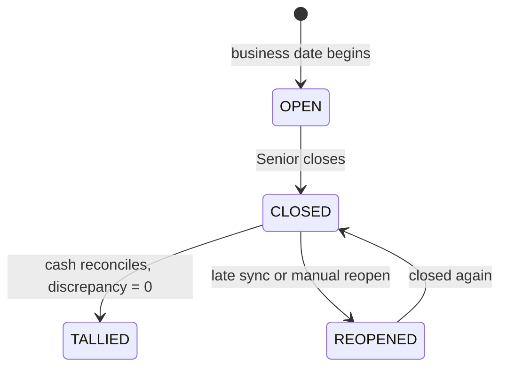

# M08 — Day Close and Cash Control

**Purpose:** reconcile each line's day, and track physical cash from the customer's hand to the office.

**Source:** PDF §19 mentions a "daily tally" but never says who holds the cash. Rules: BR-16, BR-16a, BR-17.

> **This module closes the largest gap in the source document.** The PDF tracks collection _records_ and stops there. In a business moving cash through three pairs of hands every day, the record is only half the story — the other half is who is holding the money right now.

---

## Scope

**In:** per-line day close, expected/collected/discrepancy reconciliation, cash handover Junior → Senior → Admin, denomination counts, disputes.

**Out:** collection entry (M07), ledger postings (M09 — triggered from here).

---

## Owned entities

`day_close` · `cash_handover` · `cash_denomination`

---

## Day close

One `day_close` per line per business date (BR-16).

```
expectedTotal    = Σ expected for that line's slots due that date
collectedTotal   = Σ confirmed collections for that line on that date
cashReceivedTotal = Σ acknowledged handovers
discrepancy      = cashReceivedTotal − collectedTotal
```



**`CLOSED` means the Senior has tallied what is known. `TALLIED` means the cash reconciles.** Only an Admin-locked month-end is truly immutable.

Closing locks that date's collections. A late offline sync reopens automatically (BR-16a) with the system as actor, requiring no reason; a manual reopen is Admin-and-above and requires one.

### Closing with unsynced devices is allowed, with a warning

The Senior is told which Juniors have not synced and may close anyway.

> Blocking would leave lines permanently open whenever a phone is off or out of signal — which is routine. Closing on what is known, and reopening when the rest arrives, matches how the day actually works.

---

## Cash handover

Two hops, same mechanism: Junior → Senior, then Senior → Admin.

Each handover records the declared amount, a denomination breakdown, sender, receiver, and the receiver's acknowledgement. **Cash has not moved until acknowledged** (BR-17) — that is when the ledger posts.

```
discrepancy = declaredAmount − systemAmount
```

Because each hop is counted separately, a discrepancy is attributable to a specific handover rather than to a whole day or a whole line.

### Denominations are counted, not estimated

Nine rows per handover: ₹500, ₹200, ₹100, ₹50, ₹20, ₹10, ₹5, ₹2, ₹1. The total is computed from the counts; Σ subtotals must equal `declaredAmount`.

> "₹200 short" is an argument. "One ₹200 note short" is a countable fact both parties can check on the spot, while the cash is still in the room. That is the whole value of the denomination count — it converts a dispute into an observation.
>
> Stored as rows rather than JSON so that "how many ₹500 notes passed through Line 3 last week" is a query.

### A discrepancy is recorded, never blocking

A short handover submits successfully, flagged for the Senior's attention.

> Blocking would mean the cash never gets recorded as moving at all — the worst possible outcome, since the money has physically changed hands whether or not the system accepts it. Recording the discrepancy is what makes it traceable.

Either party may **dispute**, which escalates to Admin.

---

## Mid-day reassignment

Cash follows `collection.collectedByUserId`, not current line staffing (open question 5). A Junior moved at noon still hands over the morning's cash on their old line.

---

## Operations

| Operation            | Actor                                |
| -------------------- | ------------------------------------ |
| View day close       | Admin+, Senior (own line)            |
| Close day            | Admin+, Senior (own line)            |
| Reopen day (manual)  | Admin+                               |
| Initiate handover    | Junior (own cash), Senior (own line) |
| Record denominations | Junior, Senior                       |
| Acknowledge handover | Senior (own line), Admin+            |
| Dispute handover     | Either party, Admin+                 |

---

## Events

**Emitted:** `day_close.closed` (→ M07 missed detection, M10), `day_close.reopened` (→ M10), `handover.acknowledged` (→ M09 ledger), `handover.disputed` (→ M10 alert to Admin), `day_close.discrepancy` (→ M10).

**Consumed:** `collection.confirmed` (M07) → recompute totals if the day is open, reopen if closed.

---

## Risks

| Risk                                            | Mitigation                                                                                        |
| ----------------------------------------------- | ------------------------------------------------------------------------------------------------- |
| Cash acknowledged but never physically received | Denomination count at both ends; dispute path; discrepancy visible on the line dashboard          |
| Days never close because a device is offline    | Close-with-warning; automatic reopen on late sync                                                 |
| Reopen used to alter settled figures            | Manual reopen is Admin-only, reason mandatory, audited; collections remain append-only regardless |
| Discrepancies accumulate unnoticed              | Surfaced on the Senior and Admin dashboards, and in the overdue/discrepancy report                |
