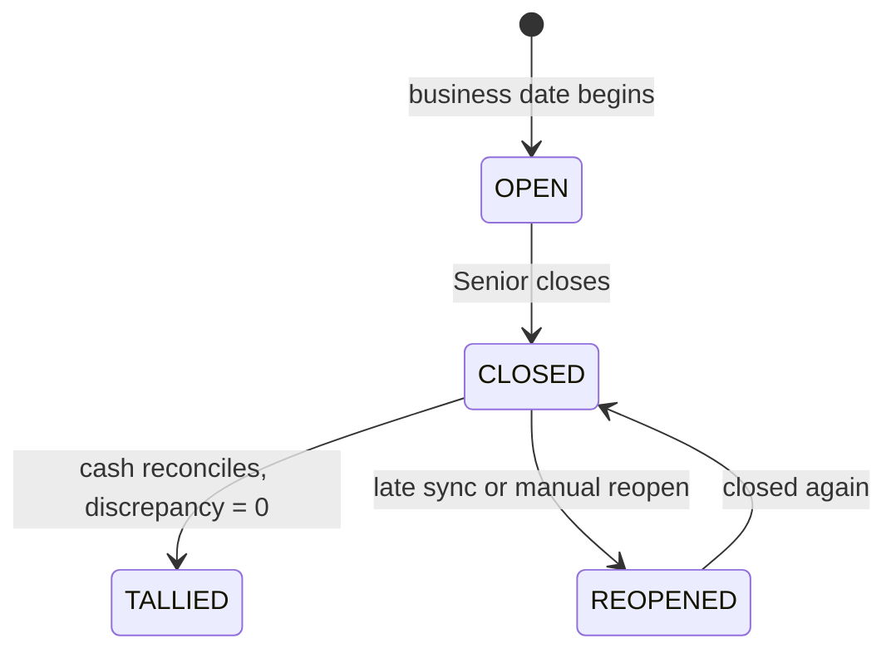

# M08 — Day Close and Cash Control

**Purpose:** reconcile each line's day, and track physical cash from the customer's hand to the office.

**Source:** PDF §19 mentions a "daily tally" but never says who holds the cash. Rules: BR-16, BR-16a, BR-17.

> **This module closes the largest gap in the source document.** The PDF tracks collection _records_ and stops there. In a business moving cash through three pairs of hands every day, the record is only half the story — the other half is who is holding the money right now.

---

## Scope

**In:** per-line day close, expected/collected/discrepancy reconciliation, cash handover Junior → Senior → Admin, denomination counts, disputes, and capital put into the business, which funds office cash (US-032).

**Out:** collection entry (M07), ledger postings (M09 — triggered from here).

---

## Owned entities

`day_close` · `cash_handover` · `cash_denomination` · `capital_entry`

---

## Day close

One `day_close` per line per business date (BR-16).

```
expectedTotal    = Σ expected for that line's slots due that date
collectedTotal   = Σ confirmed collections for that line on that date
cashReceivedTotal = Σ acknowledged handovers
expenseTotal     = Σ approved field expenses the line's Juniors paid from that day's cash (ADR-0018)
discrepancy      = cashReceivedTotal + expenseTotal − collectedTotal
```


```mermaid
stateDiagram-v2
    [*] --> OPEN: business date begins
    OPEN --> CLOSED: Senior closes
    CLOSED --> TALLIED: cash reconciles, discrepancy = 0
    CLOSED --> REOPENED: late sync or manual reopen
    REOPENED --> CLOSED: closed again
```

**`CLOSED` means the Senior has tallied what is known. `TALLIED` means the cash reconciles.** Only an Admin-locked month-end is truly immutable.

Closing locks that date's collections. A late offline sync reopens automatically (BR-16a) with the system as actor, requiring no reason; a manual reopen is Admin-and-above and requires one.

### Closing with unsynced devices is allowed, with a warning

The Senior is told which Juniors have not synced and may close anyway.

> Blocking would leave lines permanently open whenever a phone is off or out of signal — which is routine. Closing on what is known, and reopening when the rest arrives, matches how the day actually works.

---

## Cash handover

Two hops, same mechanism: Junior → Senior, then Senior → Admin.

Each handover records the declared amount, a denomination breakdown, sender, receiver, and the receiver's acknowledgement. **Cash has not moved until acknowledged** (BR-17) — that is when the ledger posts.

```
discrepancy = declaredAmount − systemAmount
```

Because each hop is counted separately, a discrepancy is attributable to a specific handover rather than to a whole day or a whole line.

### Denominations are counted, not estimated

Nine rows per handover: ₹500, ₹200, ₹100, ₹50, ₹20, ₹10, ₹5, ₹2, ₹1. The total is computed from the counts; Σ subtotals must equal `declaredAmount`.

> "₹200 short" is an argument. "One ₹200 note short" is a countable fact both parties can check on the spot, while the cash is still in the room. That is the whole value of the denomination count — it converts a dispute into an observation.
>
> Stored as rows rather than JSON so that "how many ₹500 notes passed through Line 3 last week" is a query.

### A discrepancy is recorded, never blocking

A short handover submits successfully, flagged for the Senior's attention.

> Blocking would mean the cash never gets recorded as moving at all — the worst possible outcome, since the money has physically changed hands whether or not the system accepts it. Recording the discrepancy is what makes it traceable.

Either party may **dispute**, which escalates to Admin.

---

## Mid-day reassignment

Cash follows `collection.collectedByUserId`, not current line staffing (open question 5). A Junior moved at noon still hands over the morning's cash on their old line.

---

## Operations

| Operation            | Actor                                |
| -------------------- | ------------------------------------ |
| View day close       | Admin+, Senior (own line)            |
| Close day            | Admin+, Senior (own line)            |
| Reopen day (manual)  | Admin+                               |
| Initiate handover    | Junior (own cash), Senior (own line) |
| Record denominations | Junior, Senior                       |
| Acknowledge handover | Senior (own line), Admin+            |
| Dispute handover     | Either party, Admin+                 |
| Add capital          | Super Admin                          |
| View capital         | Admin+ (as ledger entries)           |

---

## Events

**Emitted:** `day_close.closed` (→ M07 missed detection, M10), `day_close.reopened` (→ M10), `handover.acknowledged` (→ M09 ledger), `handover.disputed` (→ M10 alert to Admin), `day_close.discrepancy` (→ M10).

**Consumed:** `collection.confirmed` (M07) → recompute totals if the day is open, reopen if closed.

---

## As built

In `apps/api/src/cash/`, through `packages/contracts/src/cash.contract.ts`. Status is in the [backlog](../../06-delivery/backlog.md).

| Endpoint                                          | Permission             | Answers                                                                                                         |
| ------------------------------------------------- | ---------------------- | --------------------------------------------------------------------------------------------------------------- |
| `POST /api/devices/sync-report`                   | `collection.record`    | The phone's unsent count and oldest capture time                                                                |
| `GET /api/lines/:lineId/day-closes/:businessDate` | `dayClose.view`        | S-05: live totals, Juniors with phone sync state, exceptions, handovers, `canClose`/`canReopen`                 |
| `POST …/close`                                    | `dayClose.close`       | `409 UNSYNCED_DEVICES` naming Juniors unless `confirmUnsynced`; `409 DAY_ALREADY_CLOSED`; `422 DAY_NOT_STARTED` |
| `POST …/reopen`                                   | `dayClose.reopen`      | With a reason; `409 DAY_NOT_CLOSED`                                                                             |
| `GET /api/cash`                                   | `handover.initiate`    | What the caller still holds per line and date, receivers, recent handovers                                      |
| `POST /api/handovers`                             | `handover.initiate`    | `422 NOTE_REQUIRED`, `NOTHING_TO_HAND_OVER`, `NO_SENIOR_ON_LINE`, `RECEIVER_NOT_ADMIN`; `409 HANDOVER_PENDING`  |
| `GET /api/handovers`                              | `handover.acknowledge` | Handovers addressed to the caller                                                                               |
| `POST /api/handovers/:id/acknowledge`             | `handover.acknowledge` | Receiver only (`403 NOT_THE_RECEIVER`); posts the ledger                                                        |
| `POST /api/handovers/:id/dispute`                 | `handover.dispute`     | Sender, receiver or Admin, while pending                                                                        |
| `GET /api/capital`                                | `ledger.view`          | Capital entries newest first, with the total put in and `CASH_AT_OFFICE` now                                    |
| `POST /api/capital`                               | `capital.add`          | Super Admin only; `422 CAPITAL_DATE_IN_FUTURE` at the date field; posts the ledger                              |

**Decided 2026-09-14:**

- **Unsynced phones.** Each phone reports its queue after every drain (`device_sync_report`). A Junior is `UNSENT` for a date when their oldest unsent collection was captured on or before it, `NOT_HEARD` when there has been no report since that date began, else `SENT`. Closing with any Junior not `SENT` is refused until confirmed.
- **Missed at close.** Closing marks every slot on the line still `PENDING` for the date `MISSED`, in the same transaction, and regenerates that account's tail with no change to its balance — the plan runs a day longer (US-043). A late collection answers its `MISSED` slot. There is no job for this (M14 is not built).
- **Handover amounts.** `declaredAmount` is computed from the nine counts. `systemAmount` is what the sender recorded for the line and date less the `systemAmount` of their earlier acknowledged handovers, so late cash is handed over separately. A Junior must have recorded collections on that line and date. A count that differs needs a note; nothing is blocked.
- **Acknowledgement posts the declared amount**: receiver's `CASH_IN_HAND` (or the organisation's `CASH_AT_OFFICE` on the office hop, to the Admin the Senior picked) debit, sender's `CASH_IN_HAND` credit. Only the Junior → Senior hop counts towards the line's cash received.
- **Dispute is final**: nothing posts, and the sender submits a new count.
- **The Junior hands over in the field app, online only** (`/route#handover`).

**State:** the view computes totals live; the row stores them at each close, reopen and acknowledgement. `TALLIED` when closed with cash received equal to collected and no handover pending; an acknowledgement or dispute re-tallies. A collection or approved correction on a closed date reopens it automatically (`DayCloseService.moneyWritten`, audited as automatic by the user whose write caused it). Closing takes the due accounts' row locks before the day's row, the same order a collection takes them, so the two cannot deadlock.

**Capital (US-032, decided 2026-09-24).** Office cash was credited by every disbursement and debited by nothing but handovers to the office, so it ran negative. A Super Admin now records money put into the business in `capital_entry` — amount, the business day it arrived (today by default, never in the future) and a required note saying where it came from. In the same transaction `CapitalService` posts a `CAPITAL` ledger transaction, debit `CASH_AT_OFFICE` and credit `CAPITAL`, and writes the audit entry. The table is append-only in the database, like the ledger it feeds, so a mistake is answered by a later entry. `CAPITAL` is its own transaction type, so no invested, collected or profit figure reads it. The console shows it on Books (`/books/money`, "Capital A/c"; moved from `/cash` on 2026-10-02) to Admins and above — cash-in-hand (flagged when below zero), the total put in and each entry — with **Add capital** for the Super Admin only. A loan is paid out only from it: a day-one disbursement is refused `INSUFFICIENT_CASH_IN_HAND` when cash-in-hand is short ([M05](M05-accounts.md)).

**Field expenses (ADR-0018, built 2026-10-01).** A Junior (on `/route#expense`) or a Senior (on `/cash`) records cash they spent on the round; it waits `PENDING` and posts nothing. The hop it comes out of is stored on the row when it is asked for (`expense.hop`), so a later promotion never moves it. Someone other than the spender decides: a Junior's by the line's Senior or an Admin, a Senior's by an Admin (`POST /api/expenses/:id/decision`; `403 OWN_EXPENSE`, `403 EXPENSE_NEEDS_ADMIN`, `409 EXPENSE_ALREADY_DECIDED`). Approval posts debit the category's `EXPENSE`, credit the spender's `CASH_IN_HAND`. Then:

- **Handover:** `systemAmount` is what the sender recorded (or, for a Senior, acknowledged) **less their approved field expenses** for that line and date; `GET /api/cash` shows both. An expense still pending is not subtracted — approve it before the count, or the count reads short.
- **Day close:** the line's day stores `expenseTotal`, the Juniors' approved field expenses (`hop = JUNIOR_TO_SENIOR`), and `discrepancy = cashReceivedTotal + expenseTotal − collectedTotal`, which the database enforces. A Senior's own expense comes off only the office hop.
- **A decision re-tallies a closed day** (`refreshTally`) rather than reopening it: no recorded money changed, only how the cash is accounted for. So a day closed ₹50 short becomes `TALLIED` the moment the ₹50 petrol is approved.
- The discrepancy report (M12) counts the same expenses per Junior, so its rows still sum to the day close.

**Not built:** a notification on a close with no discrepancy (by decision, [M10](M10-notifications.md)); month-end lock; Admin resolution of a dispute beyond recounting. Owner's drawings are in Books ([ADR-0018](../../02-architecture/adr/0018-books-expenses-banks-and-journals.md)).

## Risks

| Risk                                            | Mitigation                                                                                        |
| ----------------------------------------------- | ------------------------------------------------------------------------------------------------- |
| Cash acknowledged but never physically received | Denomination count at both ends; dispute path; discrepancy visible on the line dashboard          |
| Days never close because a device is offline    | Close-with-warning; automatic reopen on late sync                                                 |
| Reopen used to alter settled figures            | Manual reopen is Admin-only, reason mandatory, audited; collections remain append-only regardless |
| Discrepancies accumulate unnoticed              | Surfaced on the Senior and Admin dashboards, and in the overdue/discrepancy report                |
