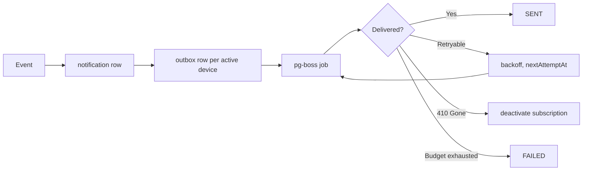

# M10 — Notifications

**Purpose:** get the right event to the right person, reliably.

**Source:** PDF §12, §24.

---

## Scope

**In:** the in-app notification centre, role-scoped delivery, push dispatch via Web Push (VAPID) and FCM, device registration, delivery retry, preferences.

**Out:** the events themselves — raised by M05, M07, M08, M03.

---

## Owned entities

`notification` · `push_subscription` · `notification_outbox`

---

## Notification and delivery are separate concerns

A **notification** is a fact the user should see — it exists in the in-app centre regardless of push. An **outbox row** is one delivery attempt against one subscription.

One notification fans out to every active device the user has registered, each retried independently.

> **Push failure never means the user was not notified.** The in-app centre is the system of record; push is an accelerator. Conflating them would mean a user with a stale FCM token silently stops being told their line has a discrepancy.

---

## Categories and events

Categories from §24:

| Category      | Meaning                                        |
| ------------- | ---------------------------------------------- |
| `INFORMATION` | New customer, new assignment                   |
| `SUCCESS`     | Day tallied, account completed                 |
| `WARNING`     | Extra collection, pending collection           |
| `ALERT`       | Low collection, missed collection, discrepancy |

| Event                   | Recipient                | Category      | Source |
| ----------------------- | ------------------------ | ------------- | ------ |
| `NEW_ASSIGNMENT`        | Both staff, both Seniors | `INFORMATION` | M03    |
| `LOW_COLLECTION`        | Senior of the line       | `ALERT`       | M07    |
| `EXTRA_COLLECTION`      | Senior of the line       | `WARNING`     | M07    |
| `MISSED_COLLECTION`     | Senior of the line       | `ALERT`       | M07    |
| `ACCOUNT_COMPLETED`     | Senior of the line       | `SUCCESS`     | M05    |
| `DAY_CLOSE_DISCREPANCY` | Senior, Admin            | `ALERT`       | M08    |
| `APPROVAL_REQUESTED`    | Senior of the line       | `WARNING`     | M07    |

Every notification carries a `payload` with entity type and id, so tapping it deep-links to the subject.

### Scoping

| Role        | Receives          |
| ----------- | ----------------- |
| Super Admin | All               |
| Admin       | Operational       |
| Senior      | Their line        |
| Junior      | Their own entries |

Matches Appendix A. "Senior of the line" means the current assignment at the moment the event fires (M03).

---

## Push: two providers, one interface

Both Web Push (VAPID) and FCM are supported, selected by environment variable. Design in [`../../02-architecture/notifications.md`](../../02-architecture/notifications.md).

A single `push_subscription` table covers both, discriminated by `provider`: Web Push uses `endpoint` + `p256dh` + `auth`, FCM uses `fcmToken`. Columns are nullable and mutually exclusive per row, checked by a constraint.

> Keeping both behind one interface means provider choice is a runtime concern, not a schema difference or a code change. Switching the env variable changes delivery and nothing else.

**Subscription hygiene:** a `410 Gone` from the push service deactivates the subscription immediately. Repeated failures deactivate after a retry budget is exhausted. Dead subscriptions are never retried indefinitely.

---

## Delivery

Retry uses exponential backoff via pg-boss (M14). The in-app notification is written **synchronously with the triggering transaction**; push dispatch is asynchronous.

> Writing the notification synchronously means the user's centre is correct even if the queue is backed up or the push service is down. Only the acceleration is asynchronous.

---

## Preferences

Per-category opt-out. **`ALERT` cannot be disabled** — low collections, missed visits and cash discrepancies are the notifications the business exists to act on.

---

## Operations

| Operation                 | Actor        |
| ------------------------- | ------------ |
| List own notifications    | All          |
| Mark read / mark all read | Self         |
| Register device           | All          |
| Deregister device         | Self, Admin+ |
| Manage preferences        | Self         |

---

## Risks

| Risk                                           | Mitigation                                                                                                                                                 |
| ---------------------------------------------- | ---------------------------------------------------------------------------------------------------------------------------------------------------------- |
| **Alert fatigue**                              | Exact-match classification (no tolerance band); missed detection deferred until after day close; `SUCCESS` notifications are not pushed, only shown in-app |
| Stale push tokens                              | `410` deactivation; `lastSeenAt` tracking                                                                                                                  |
| Push provider outage                           | In-app centre unaffected; outbox retries                                                                                                                   |
| Notification storm on holiday misconfiguration | Holidays suppress missed detection entirely (M06)                                                                                                          |
| Senior changed mid-event                       | Recipient resolved at event time from current assignment                                                                                                   |
