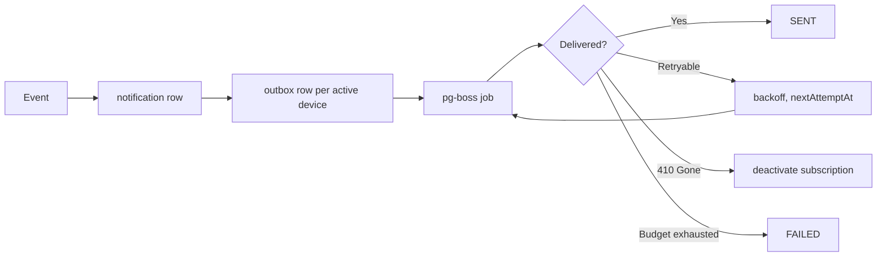

# M10 — Notifications

**Purpose:** get the right event to the right person, reliably.

**Source:** PDF §12, §24.

---

## Scope

**In:** the in-app notification centre, role-scoped delivery, push dispatch via Web Push (VAPID) and FCM, email over SMTP (alerts, and transactional email such as the sign-up welcome), device registration, delivery retry, preferences.

**Out:** the events themselves — raised by M05, M07, M08, M03.

---

## Owned entities

`notification` · `push_subscription` · `notification_outbox` · `email_outbox`

---

## Notification and delivery are separate concerns

A **notification** is a fact the user should see — it exists in the in-app centre regardless of push. An **outbox row** is one delivery attempt against one subscription.

One notification fans out to every active device the user has registered, each retried independently.

> **Push failure never means the user was not notified.** The in-app centre is the system of record; push is an accelerator. Conflating them would mean a user with a stale FCM token silently stops being told their line has a discrepancy.

---

## Categories and events

Categories from §24:

| Category      | Meaning                                        |
| ------------- | ---------------------------------------------- |
| `INFORMATION` | New customer, new assignment                   |
| `SUCCESS`     | Day tallied, account completed                 |
| `WARNING`     | Extra collection, pending collection           |
| `ALERT`       | Low collection, missed collection, discrepancy |

| Event                   | Recipient                | Category      | Source |
| ----------------------- | ------------------------ | ------------- | ------ |
| `NEW_ASSIGNMENT`        | Both staff, both Seniors | `INFORMATION` | M03    |
| `LOW_COLLECTION`        | Senior of the line       | `ALERT`       | M07    |
| `EXTRA_COLLECTION`      | Senior of the line       | `WARNING`     | M07    |
| `MISSED_COLLECTION`     | Senior of the line       | `ALERT`       | M07    |
| `ACCOUNT_COMPLETED`     | Senior of the line       | `SUCCESS`     | M05    |
| `DAY_CLOSE_DISCREPANCY` | Senior, Admin            | `ALERT`       | M08    |
| `APPROVAL_REQUESTED`    | Senior of the line       | `WARNING`     | M07    |

Every notification carries a `payload` with entity type and id, so tapping it deep-links to the subject.

### Scoping

| Role        | Receives          |
| ----------- | ----------------- |
| Super Admin | All               |
| Admin       | Operational       |
| Senior      | Their line        |
| Junior      | Their own entries |

Matches Appendix A. "Senior of the line" means the current assignment at the moment the event fires (M03).

---

## Push: two providers, one interface

Both Web Push (VAPID) and FCM are supported, selected by environment variable. Design in [`../../02-architecture/notifications.md`](../../02-architecture/notifications.md).

A single `push_subscription` table covers both, discriminated by `provider`: Web Push uses `endpoint` + `p256dh` + `auth`, FCM uses `fcmToken`. Columns are nullable and mutually exclusive per row, checked by a constraint.

> Keeping both behind one interface means provider choice is a runtime concern, not a schema difference or a code change. Switching the env variable changes delivery and nothing else.

**Subscription hygiene:** a `410 Gone` from the push service deactivates the subscription immediately. Repeated failures deactivate after a retry budget is exhausted. Dead subscriptions are never retried indefinitely.

---

## Delivery

Retry uses exponential backoff via pg-boss (M14). The in-app notification is written **synchronously with the triggering transaction**; push dispatch is asynchronous.

> Writing the notification synchronously means the user's centre is correct even if the queue is backed up or the push service is down. Only the acceleration is asynchronous.

---

## Preferences

Per-category opt-out. **`ALERT` cannot be disabled** — low collections, missed visits and cash discrepancies are the notifications the business exists to act on.

---

## Operations

| Operation                 | Actor        |
| ------------------------- | ------------ |
| List own notifications    | All          |
| Mark read / mark all read | Self         |
| Register device           | All          |
| Deregister device         | Self, Admin+ |
| Manage preferences        | Self         |

---

## As built

In `apps/api/src/notifications/`, `packages/notifications` and `apps/web/lib/notifications/`. Status is in the [backlog](../../06-delivery/backlog.md). Decided 2026-09-15: all of M10 at once; new events are enum values; Admins and Super Admins receive cash and integrity events; one missed-collection summary per close.

- **Raising.** `NotificationService.raise` refuses to run outside a transaction and is called inside the transaction of its event, so a rolled-back collection has no notification and no delivery rows. It skips the person who caused the event, drops a muted non-ALERT category per recipient, and writes one `notification` per recipient. For `ALERT` and `WARNING` it also writes one `notification_outbox` row per active device whose provider `PUSH_PROVIDER` allows.
- **Events and recipients** live in one place, `EventNotices`. "Senior of the line" is the Senior assigned on today's business date.

  | Event | Category | Recipients | Raised by |
  | --- | --- | --- | --- |
  | `LOW_COLLECTION`, `NO_PAYMENT_COLLECTION` | `ALERT` | Senior of the line | recording a collection |
  | `EXTRA_COLLECTION` | `WARNING` | Senior of the line | recording a collection |
  | `ACCOUNT_COMPLETED` | `SUCCESS` | Senior of the line | the collection that completes it |
  | `APPROVAL_REQUESTED` | `WARNING` | the line's Senior for a Junior's correction; the Senior and Admins for a Senior's request or any reversal | US-044 |
  | `NEW_ASSIGNMENT` | `INFORMATION` | the person assigned, the Seniors of the new and previous lines | M03 |
  | `MISSED_COLLECTION` | `ALERT` | Senior of the line — one summary per close with the count | M08 close |
  | `DAY_REOPENED` | `WARNING` | Senior of the line | BR-16a late collection or approval |
  | `HANDOVER_SUBMITTED` | `INFORMATION` | the receiver | S-06 |
  | `HANDOVER_DISPUTED` | `ALERT` | sender, receiver, Admins | US-063 |
  | `DAY_CLOSE_DISCREPANCY` | `ALERT` | Senior of the line, Admins — when acknowledged cash differs from the record | US-062 |
  | `RECONCILIATION_MISMATCH` | `ALERT` | Admins and Super Admins, one per run; links to the audit log | US-095 |

  `NO_PAYMENT_COLLECTION`, `HANDOVER_SUBMITTED`, `HANDOVER_DISPUTED`, `DAY_REOPENED` and `RECONCILIATION_MISMATCH` were added to the enum (migration `notification_events`). Not raised: new customer (M04), day closed with no discrepancy, handover acknowledged to the sender.
- **Delivery is an outbox drained every minute**, not a job per notification: the outbox rows are the transactional record, and the `dispatch-notifications` job (M14) calls `PushDispatchService.dispatch` per organization. It claims due `PENDING` rows with `FOR UPDATE SKIP LOCKED`, counts the attempt and leases the row for five minutes, sends through the subscription's provider, then records `SENT`; `PENDING` with the next delay (1 min, 5 min, 30 min, 2 h); or `FAILED` with the error. A `gone` answer, or a fifth failure, deactivates the subscription and expires its other pending rows. Push adds up to a minute of latency to the in-app row, which is immediate.
- **Providers.** `packages/notifications`: `WebPushProvider` (web-push 3.6.7; 404/410 gone, 429/5xx/network retry, other 4xx failed) and `FcmProvider` (firebase-admin 14.4.0; unregistered/invalid token gone, unavailable/quota/internal retry), each with an injectable transport; `outcome()` holds the retry table once. A provider that is selected but not configured answers `retry`. Configuration refuses to start without the keys of the selected provider.
- **Preferences.** `notification_preference` holds one row per user and category that differs from the default (on). `ALERT` cannot be switched off — `422 ALERT_ALWAYS_ON` at the API, a CHECK in the database.
- **Routes.** `GET /api/notifications` (newest first, `unread`, `category`, with `unreadCount`), `POST /api/notifications/:id/read`, `POST /api/notifications/read-all`, `GET /api/push/config` (provider and VAPID public key), `GET|POST /api/push-subscriptions` (register refreshes by endpoint or token; `422 PUSH_PROVIDER_DISABLED`; a Web Push endpoint must be on a known browser push service — FCM, Mozilla, Windows WNS, Apple — or it is `422 PUSH_ENDPOINT_NOT_ALLOWED`, because the server POSTs to it, and dispatch refuses and deactivates any other stored endpoint; a device re-registered by a different user expires the previous user's queued pushes), `DELETE /api/push-subscriptions/:id` (own, or any in the organization for Admin and above), `GET|PATCH /api/notification-preferences`. Another user's notification or device is `404`.
- **Web.** The console has a Notifications nav item with the unread count, a bell in the mobile header, and `/notifications` (S-21): grouped by business day, unread filter, mark read, mark all read, a "Notify me on this device" switch and the category preferences. The Junior's status bar has a bell opening `/route#notifications` (needs signal; notifications are not stored on the phone, and their links point at console pages so rows are marked read instead). The bell polls every minute while visible. Push permission is asked only from a tap. The Junior's field worker (`app/sw.ts`) shows pushes and opens `/route#notifications`; the console registers a separate push-only worker, `public/push-sw.js` with scope `/push/`, so no console page is controlled by a worker.

**Tests.** Tier 1 `test/notifications/notifications.spec.ts`: each Senior alert and who does not receive it, the missed summary, reopen, the three cash events, correction approvers, preferences, delivery rows per device, dispatch with sent / retry / gone, and the centre; assignment and reconciliation notices in their own specs; three constraint specs. HTTP `test/notifications.e2e-spec.ts` and the RBAC matrix cover all nine routes; Tier 2 writes only notifications, devices and preferences, which cascade with the run's staff.

**Not built:** real delivery through Web Push or FCM (no keys configured; providers are proven with fake transports), `deactivate-stale-subscriptions`, FCM registration from a native client, a dead-letter alert.

### As built — email (decided 2026-09-15)

Design and rationale in [notifications.md#email](../../02-architecture/notifications.md#email).

- **Switch.** `EMAIL_PROVIDER=SMTP` with `SMTP_HOST` and `EMAIL_FROM`, plus optional `SMTP_PORT` (587), `SMTP_SECURE` (`false`) and `SMTP_USER` / `SMTP_PASS` (both or neither). Configuration refuses to start with SMTP half-configured. `NONE`, the default, queues nothing.
- **What is emailed.**
  - Every `ALERT` notification, to each recipient who is staff, with the notification's title and body and an absolute link built from `WEB_ORIGIN`. `WARNING` is not emailed: it fires on every extra collection and correction request.
  - A **welcome email** to an organization's owner at sign-up (US-006), with the business's sign-in link.
  - `GET /api/notification-preferences` gains `emailed` per category, true for `ALERT` while email is configured. The web shows "· emailed".
- **Queueing.** `EmailOutbox.queue` (`apps/api/src/email/email-outbox.ts`) writes an `email_outbox` row and refuses to run outside a transaction (`500 EMAIL_OUTSIDE_TRANSACTION`). The row commits or rolls back with its cause, and a slow mail server never holds up a request. The row stores the rendered subject, text and HTML, and the recipient user — **not the address**, which is read at send time.
- **Delivery.** The `dispatch-emails` job runs every minute per organization, only with `WORKER_ENABLED=true`. `EmailDispatchService` claims due rows with `FOR UPDATE SKIP LOCKED` and a five-minute lease, 50 per run, and records one of:
  - `SENT`, with `sentAt`
  - `PENDING`, with the push backoff (1, 5, 30 and 120 minutes)
  - `FAILED`, with the server's reply as `lastError`
  - `EXPIRED`, when the recipient is no longer an active staff member
  
  With no provider configured, queued rows are left alone. A failure is logged with the row id and attempt count only.
- **Provider.** `SmtpEmailProvider` in `packages/notifications` uses Nodemailer 10.0.10: a pooled transport with 30-second timeouts, and an injectable transport for tests. It classifies failures as follows:
  - An SMTP 4xx reply is retried; a 5xx reply fails.
  - Without a reply code, connection, DNS, TLS and login errors are retried, and envelope and message errors fail.
  
  A login failure is retried so an operator can fix the password before the attempts run out. That holds even when the rejection arrives as a 5xx reply, which is how Gmail sends `535 5.7.8`: Nodemailer's `EAUTH` code is checked before the reply code.
- **Checking the settings.** `pnpm --filter api email:test <address>`, after `pnpm build`, sends one email straight through the configured server, with no database, queue or worker, and prints the server's reply if it is refused. It was proven against Gmail SMTP on 2026-09-15.
- **Content.** `email-templates.ts` holds pure functions. Every email has a plain-text part and a minimal HTML part with inline styles, no images and no tracking. Every value is HTML-escaped, and subjects are kept to one line.

**Tests.**
- `packages/notifications/src/smtp-email-provider.spec.ts`: message shape and failure classification.
- Tier 1 `test/email/email.spec.ts`:
  - queueing refused outside a transaction
  - `ALERT` emailed and `WARNING` not; `NONE` queues nothing
  - dispatch outcomes: sent to the current address, retry with backoff, permanent failure, not yet due, another organization, expired for suspended staff, no provider
  - template escaping and header injection
- The sign-up spec covers the welcome email. Five `email_outbox` constraint specs. Config specs.
- **HTTP tests never send email.** `createTestApp` forces `EMAIL_PROVIDER=NONE` over whatever the developer's `.env` holds, so results do not depend on local SMTP settings.

**Not built:** email verification and self-service password reset through Better Auth (the provider now exists; both are open decisions, M01), per-user email preferences, a health check on the SMTP server, bounce handling.

---

## Risks

| Risk                                           | Mitigation                                                                                                                                                 |
| ---------------------------------------------- | ---------------------------------------------------------------------------------------------------------------------------------------------------------- |
| **Alert fatigue**                              | Exact-match classification (no tolerance band); missed detection deferred until after day close; `SUCCESS` notifications are not pushed, only shown in-app |
| Stale push tokens                              | `410` deactivation; `lastSeenAt` tracking                                                                                                                  |
| Push provider outage                           | In-app centre unaffected; outbox retries                                                                                                                   |
| Notification storm on holiday misconfiguration | Holidays suppress missed detection entirely (M06)                                                                                                          |
| Senior changed mid-event                       | Recipient resolved at event time from current assignment                                                                                                   |
