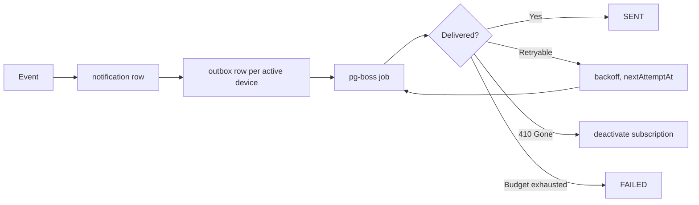

# M10 — Notifications

**Purpose:** get the right event to the right person, reliably.

**Source:** PDF §12, §24.

---

## Scope

**In:** the in-app notification centre, role-scoped delivery, push dispatch via Web Push (VAPID) and FCM, email over SMTP (alerts, and transactional email such as the sign-up welcome), device registration, delivery retry, preferences, and message templates — every message's words per business in English and Tamil, and its channels (US-074).

**Out:** the events themselves — raised by M05, M07, M08, M03.

---

## Owned entities

`notification` · `push_subscription` · `notification_outbox` · `email_outbox` · `notification_preference` · `notification_template` · `notification_channel`

---

## Notification and delivery are separate concerns

A **notification** is a fact the user should see — it exists in the in-app centre regardless of push. An **outbox row** is one delivery attempt against one subscription.

One notification fans out to every active device the user has registered, each retried independently.

> **Push failure never means the user was not notified.** The in-app centre is the system of record; push is an accelerator. Conflating them would mean a user with a stale FCM token silently stops being told their line has a discrepancy.

---

## Categories and events

Categories from §24:

| Category      | Meaning                                        |
| ------------- | ---------------------------------------------- |
| `INFORMATION` | New customer, new assignment                   |
| `SUCCESS`     | Day tallied, account completed                 |
| `WARNING`     | Extra collection, pending collection           |
| `ALERT`       | Low collection, missed collection, discrepancy |

| Event                   | Recipient                | Category      | Source |
| ----------------------- | ------------------------ | ------------- | ------ |
| `NEW_ASSIGNMENT`        | Both staff, both Seniors | `INFORMATION` | M03    |
| `LOW_COLLECTION`        | Senior of the line       | `ALERT`       | M07    |
| `EXTRA_COLLECTION`      | Senior of the line       | `WARNING`     | M07    |
| `MISSED_COLLECTION`     | Senior of the line       | `ALERT`       | M07    |
| `ACCOUNT_COMPLETED`     | Senior of the line       | `SUCCESS`     | M05    |
| `DAY_CLOSE_DISCREPANCY` | Senior, Admin            | `ALERT`       | M08    |
| `APPROVAL_REQUESTED`    | Senior of the line       | `WARNING`     | M07    |

Every notification carries a `payload` with entity type and id, so tapping it deep-links to the subject.

### Scoping

| Role        | Receives          |
| ----------- | ----------------- |
| Super Admin | All               |
| Admin       | Operational       |
| Senior      | Their line        |
| Junior      | Their own entries |

Matches Appendix A. "Senior of the line" means the current assignment at the moment the event fires (M03).

---

## Push: two providers, one interface

Both Web Push (VAPID) and FCM are supported, selected by environment variable. Design in [`../../02-architecture/notifications.md`](../../02-architecture/notifications.md).

A single `push_subscription` table covers both, discriminated by `provider`: Web Push uses `endpoint` + `p256dh` + `auth`, FCM uses `fcmToken`. Columns are nullable and mutually exclusive per row, checked by a constraint.

> Keeping both behind one interface means provider choice is a runtime concern, not a schema difference or a code change. Switching the env variable changes delivery and nothing else.

**Subscription hygiene:** a `410 Gone` from the push service deactivates the subscription immediately. Repeated failures deactivate after a retry budget is exhausted. Dead subscriptions are never retried indefinitely.

---

## Delivery

```mermaid
graph LR
    A[Event] --> B[notification row]
    B --> C[outbox row per active device]
    C --> D[pg-boss job]
    D --> E{Delivered?}
    E -->|Yes| F[SENT]
    E -->|Retryable| G[backoff, nextAttemptAt]
    G --> D
    E -->|410 Gone| H[deactivate subscription]
    E -->|Budget exhausted| I[FAILED]
```

Retry uses exponential backoff via pg-boss (M14). The in-app notification is written **synchronously with the triggering transaction**; push dispatch is asynchronous.

> Writing the notification synchronously means the user's centre is correct even if the queue is backed up or the push service is down. Only the acceleration is asynchronous.

---

## Preferences

Per-category opt-out. **`ALERT` cannot be disabled** — low collections, missed visits and cash discrepancies are the notifications the business exists to act on.

---

## Operations

| Operation                 | Actor        |
| ------------------------- | ------------ |
| List own notifications    | All          |
| Mark read / mark all read | Self         |
| Register device           | All          |
| Deregister device         | Self, Admin+ |
| Manage preferences        | Self         |
| Choose own language       | Self         |
| Manage message templates  | Super Admin  |

---

## As built

In `apps/api/src/notifications/`, `packages/notifications` and `apps/web/lib/notifications/`. Status is in the [backlog](../../06-delivery/backlog.md). Decided 2026-09-15: all of M10 at once; new events are enum values; Admins and Super Admins receive cash and integrity events; one missed-collection summary per close.

- **Raising.** `NotificationService.raise` refuses to run outside a transaction and is called inside the transaction of its event, so a rolled-back collection has no notification and no delivery rows. It skips the person who caused the event, drops a muted non-ALERT category per recipient, and writes one `notification` per recipient. For `ALERT` and `WARNING` it also writes one `notification_outbox` row per active device whose provider `PUSH_PROVIDER` allows.
- **Events and recipients** live in one place, `EventNotices`. "Senior of the line" is the Senior assigned on today's business date.

  | Event                                     | Category      | Recipients                                                                                                | Raised by                          |
  | ----------------------------------------- | ------------- | --------------------------------------------------------------------------------------------------------- | ---------------------------------- |
  | `LOW_COLLECTION`, `NO_PAYMENT_COLLECTION` | `ALERT`       | Senior of the line                                                                                        | recording a collection             |
  | `EXTRA_COLLECTION`                        | `WARNING`     | Senior of the line                                                                                        | recording a collection             |
  | `ACCOUNT_COMPLETED`                       | `SUCCESS`     | Senior of the line                                                                                        | the collection that completes it   |
  | `APPROVAL_REQUESTED`                      | `WARNING`     | the line's Senior for a Junior's correction; the Senior and Admins for a Senior's request or any reversal | US-044                             |
  | `NEW_ASSIGNMENT`                          | `INFORMATION` | the person assigned, the Seniors of the new and previous lines                                            | M03                                |
  | `MISSED_COLLECTION`                       | `ALERT`       | Senior of the line — one summary per close with the count                                                 | M08 close                          |
  | `DAY_REOPENED`                            | `WARNING`     | Senior of the line                                                                                        | BR-16a late collection or approval |
  | `HANDOVER_SUBMITTED`                      | `INFORMATION` | the receiver                                                                                              | S-06                               |
  | `HANDOVER_DISPUTED`                       | `ALERT`       | sender, receiver, Admins                                                                                  | US-063                             |
  | `DAY_CLOSE_DISCREPANCY`                   | `ALERT`       | Senior of the line, Admins — when acknowledged cash differs from the record                               | US-062                             |
  | `RECONCILIATION_MISMATCH`                 | `ALERT`       | Admins and Super Admins, one per run; links to the audit log                                              | US-095                             |
  | `HOLIDAY_DECLARED`, `HOLIDAY_REMOVED`     | `WARNING`     | Seniors and Juniors assigned today to the active lines the holiday covers (a sector's, or every line)     | US-093 (M06)                       |

  `NO_PAYMENT_COLLECTION`, `HANDOVER_SUBMITTED`, `HANDOVER_DISPUTED`, `DAY_REOPENED` and `RECONCILIATION_MISMATCH` were added to the enum (migration `notification_events`); `HOLIDAY_DECLARED` and `HOLIDAY_REMOVED` on 2026-09-17 (migration `holiday_events`); `NEW_CUSTOMER` and `HANDOVER_ACKNOWLEDGED` on 2026-09-20 (migration `customer_handover_events`). A holiday notice links Seniors to `/settings/holidays` and Juniors to `/route`.

  | `NEW_CUSTOMER` | `INFORMATION` | Senior of the line the customer joins | onboarding (US-020, M04) |
  | `HANDOVER_ACKNOWLEDGED` | `SUCCESS`, or `WARNING` when the count differs | the sender, never the receiver who acted | acknowledgement (US-062) |

  | `ACCOUNT_OVERDUE` | `WARNING` | Senior of the line — one summary per line per run, not one per account | the nightly overdue job (M14, BR-05) |

  | `ACCOUNT_DISBURSED` | `INFORMATION` | Senior of the customer's line today — never the Admin who disbursed | disbursement, and a mid-term account's entry (US-032, US-030a, M05) |

  | `JOB_FAILED` | `ALERT` | Admins and Super Admins of the organization whose scheduled job was dead-lettered; links home, as there is no job screen yet | M14 (migration `job_failed_event`, 2026-09-24) |

  | `EXPENSE_REQUESTED` | `WARNING` | A Junior's: the line's Senior and the Admins; a Senior's own: the Admins — never the spender; links to `/cash#field-expenses` | a field expense asked for (ADR-0018, migration `expense_notification_events`, 2026-10-01) |

  | `EXPENSE_DECIDED` | `SUCCESS` approved / `WARNING` rejected | The spender, with a rejection's reason; links to `/route#expense` | a field expense approved or rejected (ADR-0018) |

  **Decided 2026-09-24 with the business** (migration `account_disbursed_event`): a disbursed account is a new visit on the round, so the Senior hears the instalment and the day it starts — "₹150.00 a day from 05 Jan 2026". A mid-term account says "running account" and gives its first unpaid slot, not its original first day. The recipient is the Senior of the customer's **current** line, which a transfer can make different from the line the account was opened on. Links to the account.

  **Decided 2026-09-20 with the business:** an overdue account is a `WARNING`, not an `ALERT` — going overdue is expected on a slow account, and the loud events stay the low and no-payment visits of a single day. The notice links to the overdue report filtered to that line (US-087), which is where the list belongs.

  **Still not raised, both by decision:** a day closed with no discrepancy (the events cover discrepancies only), and anything about staff being created, suspended or removed — the audit log already records who did what, and a notification would tell other Admins about routine administration (decided 2026-09-20).

- **Delivery is an outbox drained every minute**, not a job per notification: the outbox rows are the transactional record, and the `dispatch-notifications` job (M14) calls `PushDispatchService.dispatch` per organization. It claims due `PENDING` rows with `FOR UPDATE SKIP LOCKED`, counts the attempt and leases the row for five minutes, sends through the subscription's provider, then records `SENT`; `PENDING` with the next delay (1 min, 5 min, 30 min, 2 h); or `FAILED` with the error. A `gone` answer, or a fifth failure, deactivates the subscription and expires its other pending rows. Push adds up to a minute of latency to the in-app row, which is immediate.
- **Providers.** `packages/notifications`: `WebPushProvider` (web-push 3.6.7; 404/410 gone, 429/5xx/network retry, other 4xx failed) and `FcmProvider` (firebase-admin 14.4.0; unregistered/invalid token gone, unavailable/quota/internal retry), each with an injectable transport; `outcome()` holds the retry table once. A provider that is selected but not configured answers `retry`. Configuration refuses to start without the keys of the selected provider.
- **Preferences.** `notification_preference` holds one row per user and category that differs from the default (on). `ALERT` cannot be switched off — `422 ALERT_ALWAYS_ON` at the API, a CHECK in the database.
- **Routes.** `GET /api/notifications` (newest first, `unread`, `category`, with `unreadCount`), `POST /api/notifications/:id/read`, `POST /api/notifications/read-all`, `GET /api/push/config` (provider and VAPID public key), `GET|POST /api/push-subscriptions` (register refreshes by endpoint or token; `422 PUSH_PROVIDER_DISABLED`; a Web Push endpoint must be on a known browser push service — FCM, Mozilla, Windows WNS, Apple — or it is `422 PUSH_ENDPOINT_NOT_ALLOWED`, because the server POSTs to it, and dispatch refuses and deactivates any other stored endpoint; a device re-registered by a different user expires the previous user's queued pushes), `DELETE /api/push-subscriptions/:id` (own, or any in the organization for Admin and above), `GET|PATCH /api/notification-preferences`. Another user's notification or device is `404`.
- **Web.** In the console the bell **is** the centre (S-21), in the top bar on a computer and the app bar on a phone, with the unread count on it. Pressing it opens `NotificationPanel` (`lib/notifications/notification-panel.tsx`) — a `Popover` on a computer, a `Dialog placement="sheet"` on a phone — grouped by business day, with the unread filter, mark read, mark all read and "Show more". There is **no `/notifications` page and no nav item** (2026-09-21): a notification is read on the way to its subject, so following its deep link marks it read and closes the panel behind it. The panel is mounted only while open, so the list is fetched on the first press; the unread count alone is polled. "Notify me on this device" and the category preferences are the `/settings/notifications` tab, one of the Settings group's tabs, open to every console role because both are per user. The Junior's status bar has a bell opening `/route#notifications` (needs signal; notifications are not stored on the phone, and their links point at console pages so rows are marked read instead). The bell polls every minute while visible. Push permission is asked only from a tap. Since 2026-10-02 a device is asked **once**: the first time the dashboard opens on a browser where push is set up and supported, notifications are not blocked, the browser is not registered for pushes (one that allowed them but never finished registering counts as not registered), and the device has not been asked before, a confirm dialog offers to turn them on (`lib/notifications/push-prompt.tsx`). Its button makes the browser's permission request. Any answer, "Not now" included, is remembered in that browser's storage, so the same device is never asked again and a new device is; the switch on `/settings/notifications` remains the way to change it. The same day `enablePush` stopped waiting on `navigator.serviceWorker.ready` — it never resolves on a console page, because the push worker's scope is `/push/` — and waits for that registration's own worker instead, which had left the switch stuck at "Turning on…". It also asks for permission before fetching the key, while the tap still counts. The Junior's field worker (`app/sw.ts`) shows pushes and opens `/route#notifications`; the console registers a separate push-only worker, `public/push-sw.js` with scope `/push/`, so no console page is controlled by a worker.

**Tests.** Tier 1 `test/notifications/notifications.spec.ts`: each Senior alert and who does not receive it, the missed summary, reopen, the three cash events, correction approvers, preferences, delivery rows per device, dispatch with sent / retry / gone, and the centre; assignment and reconciliation notices in their own specs; three constraint specs. HTTP `test/notifications.e2e-spec.ts` and the RBAC matrix cover all nine routes; Tier 2 writes only notifications, devices and preferences, which cascade with the run's staff.

**Web Push is live in development** (2026-09-24): the `.env` carries VAPID keys and `PUSH_PROVIDER=WEB_PUSH`, and `pnpm --filter api push:test <email>` (after `pnpm build`) sends one test push to each browser that person has registered, through the real provider, writing nothing. Its first run was accepted by Microsoft's push service for a Windows browser.

**Not built:** FCM delivery, which waits for a Firebase project (decided 2026-09-24: later), and FCM registration from a native client. (`deactivate-stale-subscriptions` and the dead-letter alert were built on 2026-09-24 — see [M14](M14-jobs.md#as-built).)

### As built — email (decided 2026-09-15)

Design and rationale in [notifications.md#email](../../02-architecture/notifications.md#email).

- **Switch.** `EMAIL_PROVIDER=SMTP` with `SMTP_HOST` and `EMAIL_FROM`, plus optional `SMTP_PORT` (587), `SMTP_SECURE` (`false`) and `SMTP_USER` / `SMTP_PASS` (both or neither). Configuration refuses to start with SMTP half-configured. `NONE`, the default, queues nothing.
- **What is emailed.**
  - Every `ALERT` notification, to each recipient who is staff, with the notification's title and body and an absolute link built from `WEB_ORIGIN`. `WARNING` is not emailed: it fires on every extra collection and correction request.
  - A **welcome email** to an organization's owner at sign-up (US-006), with the business's sign-in link.
  - `GET /api/notification-preferences` gains `emailed` per category, true for `ALERT` while email is configured. The web shows "· emailed".
- **Queueing.** `EmailOutbox.queue` (`apps/api/src/email/email-outbox.ts`) writes an `email_outbox` row and refuses to run outside a transaction (`500 EMAIL_OUTSIDE_TRANSACTION`). The row commits or rolls back with its cause, and a slow mail server never holds up a request. The row stores the rendered subject, text and HTML, and the recipient user — **not the address**, which is read at send time.
- **Delivery.** The `dispatch-emails` job runs every minute per organization, only with `WORKER_ENABLED=true`. `EmailDispatchService` claims due rows with `FOR UPDATE SKIP LOCKED` and a five-minute lease, 50 per run, and records one of:
  - `SENT`, with `sentAt`
  - `PENDING`, with the push backoff (1, 5, 30 and 120 minutes)
  - `FAILED`, with the server's reply as `lastError`
  - `EXPIRED`, when the recipient is no longer an active staff member

  With no provider configured, queued rows are left alone. A failure is logged with the row id and attempt count only.

- **Provider.** `SmtpEmailProvider` in `packages/notifications` uses Nodemailer 10.0.10: a pooled transport with 30-second timeouts, and an injectable transport for tests. It classifies failures as follows:
  - An SMTP 4xx reply is retried; a 5xx reply fails.
  - Without a reply code, connection, DNS, TLS and login errors are retried, and envelope and message errors fail.

  A login failure is retried so an operator can fix the password before the attempts run out. That holds even when the rejection arrives as a 5xx reply, which is how Gmail sends `535 5.7.8`: Nodemailer's `EAUTH` code is checked before the reply code.

- **Checking the settings.** `pnpm --filter api email:test <address>`, after `pnpm build`, sends one email straight through the configured server, with no database, queue or worker, and prints the server's reply if it is refused. It was proven against Gmail SMTP on 2026-09-15.
- **Content.** `email-templates.ts` holds the layout as pure functions. Every email has a plain-text part and a minimal HTML part with inline styles, no images and no tracking. Every value is HTML-escaped, and subjects are kept to one line. Since 2026-10-02 the notification and password-reset emails are rendered from message templates into this layout ([below](#as-built--message-templates-us-074-decided-2026-10-02)); only the welcome email is still written in code.

**Tests.**

- `packages/notifications/src/smtp-email-provider.spec.ts`: message shape and failure classification.
- Tier 1 `test/email/email.spec.ts`:
  - queueing refused outside a transaction
  - `ALERT` emailed and `WARNING` not; `NONE` queues nothing
  - dispatch outcomes: sent to the current address, retry with backoff, permanent failure, not yet due, another organization, expired for suspended staff, no provider
  - template escaping and header injection
- The sign-up spec covers the welcome email. Five `email_outbox` constraint specs. Config specs.
- **HTTP tests never send email.** `createTestApp` forces `EMAIL_PROVIDER=NONE` over whatever the developer's `.env` holds, so results do not depend on local SMTP settings.

**Not built:** email verification through Better Auth (an open decision, M01), per-user email preferences, a health check on the SMTP server, bounce handling. (Self-service password reset was built on 2026-09-20, US-003.)

### As built — message templates (US-074, decided 2026-10-02)

Decision and rationale in [ADR-0019](../../02-architecture/adr/0019-message-templates.md). The owner decided four things: templates are per business and edited by its Super Admin alone; in-app, push and email words, per-message channels and the password-reset email are all editable; English and Tamil; and email is built from structured fields.

- **Catalogue.** `apps/api/src/notifications/templates/catalogue.ts` lists 27 messages: 26 that raise a notification, and `PASSWORD_RESET`, which is email only.
  - A message is finer than an event. Approved and rejected expenses, a correction and a reversal, cash short and over, a new and a running account, a matching and a differing handover count, and a holiday declared and removed are each two messages.
  - Each message has one category, its placeholders with sample values, and defaults in English and Tamil.
  - The English defaults are the wording `EventNotices` wrote before, except the reconciliation summary, which is now sentences. The Tamil defaults were written on 2026-10-02 and **have not been read by a native speaker**.
  - The welcome email stays code (`welcomeEmail`): it is sent before the business exists to have a template.
- **Placeholders.** `{{name}}` inserts a value, `{{#name}}…{{/name}}` shows its words only when `name` has a value, and `{{^name}}…{{/name}}` only when it has none (`template-engine.ts`).
  - The in-app words may use the event's placeholders and `{{organizationName}}`. The email may also use `{{title}}` and `{{body}}`, the in-app words as rendered. That is how every notification email defaults: subject `{{title}} — {{organizationName}}`, heading `{{title}}`, message `{{body}}`.
- **Raising.** `NotificationService.raise` takes a template key and pre-formatted values instead of a title and body. Inside the event's transaction it:
  - reads the business's override and channel rows for that message, once per business;
  - renders once per language;
  - stores each recipient's copy as text, so a later edit never changes a sent notification.

  A field that renders blank falls back to the default's words, and a placeholder unknown to the catalogue renders as nothing. Rendering never throws.

- **Channels.** The default comes from the category: `ALERT` and `WARNING` pushed, `ALERT` emailed. A business may change push and email per message, and the in-app centre always gets it.
  - An `ALERT`'s push and email are locked on: `422 CHANNEL_LOCKED`, and the resolver ignores any stored row for one.
  - `PASSWORD_RESET` is always emailed and has no push (`422 CHANNEL_NOT_AVAILABLE`).
  - Preferences report a category as pushed or emailed when any of its messages is.
- **Language.** `staff_profile.language` (`EN` | `TA`, default `EN`) is each person's own choice, through `PATCH /api/notification-preferences` with `language` (not audited, like the categories).
  - The console has it on `/settings/notifications`; the Junior has it on Profile (J-08), which needs signal.
  - The password-reset email uses the business's template in the reader's language too.
- **Routes**, `notificationTemplate.view` / `.manage`, Super Admin only:
  - `GET /api/notification-templates`: every message with its channels and overridden languages, and whether push and email are configured on this server.
  - `GET /api/notification-templates/:key`: placeholders and, per language, the words in force and the default.
  - `PATCH /api/notification-templates/:key/:language`: save. Words equal to the default drop the override. `422 TEMPLATE_INVALID` names each field; `TEMPLATE_UNCHANGED`.
  - `DELETE /api/notification-templates/:key/:language`: reset (`422 TEMPLATE_NOT_OVERRIDDEN`).
  - `PATCH /api/notification-templates/:key`: channels.
  - `POST /api/notification-templates/:key/preview`: unsaved words rendered with samples through the real email layout. Writes nothing.
  - `POST /api/notification-templates/:key/test`: the saved words with samples, marked "Test", to the caller's own centre, every device (whatever the push choice) and inbox.

  Saves, resets and channel changes are audited (`notification_template` CREATE/UPDATE/DELETE, `notification_channel` CREATE/UPDATE).

- **Web.** `/settings/templates` is a Settings tab for the Super Admin. It lists the messages by area, one `DataView` per area (a table on a computer, cards on a phone): message and description, category, recipients, channels, and whose words each language uses. The whole row opens the editor.
  - `/settings/templates/:key` is the editor: channel switches, one tab per language, the in-app and email fields, and placeholder chips that insert at the cursor.
  - Its preview is rendered by the API 400 ms after typing stops, marking problems at their field. It shows a bell row and the email in a sandboxed `iframe`.
  - Save, discard, "Use Rasi's words" (confirmed) and "Send a test to me" complete it.

**Tests.**

- `src/notifications/templates/template-engine.spec.ts`: the placeholder rules.
- `catalogue.spec.ts`: every default in both languages is valid, within the contract limits and fully rendered with its samples; every notification event has a message; the old English wording is kept; channel defaults and locks.
- Tier 1 `test/notifications/templates.spec.ts`:
  - a business's words in each reader's language, and another business unaffected
  - a sent notification keeping its words
  - refusals by field
  - the audit trail of save, edit and reset
  - channel choices deciding push and email
  - the locks
  - the preview's escaping
  - the test send
  - the password reset in the business's words and in Tamil
  - the language preference
- `test/db-constraints/notification-templates.spec.ts`: the three CHECKs and the unique key.
- The RBAC matrix and audit coverage list the seven routes.

**Not built:** a browser pass of the two screens in `test:layout`, and the HTTP e2e run of the new routes (the RBAC matrix entries exist; see the backlog row).

---

## Risks

| Risk                                           | Mitigation                                                                                                                                                 |
| ---------------------------------------------- | ---------------------------------------------------------------------------------------------------------------------------------------------------------- |
| **Alert fatigue**                              | Exact-match classification (no tolerance band); missed detection deferred until after day close; `SUCCESS` notifications are not pushed, only shown in-app |
| Stale push tokens                              | `410` deactivation; `lastSeenAt` tracking                                                                                                                  |
| Push provider outage                           | In-app centre unaffected; outbox retries                                                                                                                   |
| Notification storm on holiday misconfiguration | Holidays suppress missed detection entirely (M06)                                                                                                          |
| Senior changed mid-event                       | Recipient resolved at event time from current assignment                                                                                                   |
