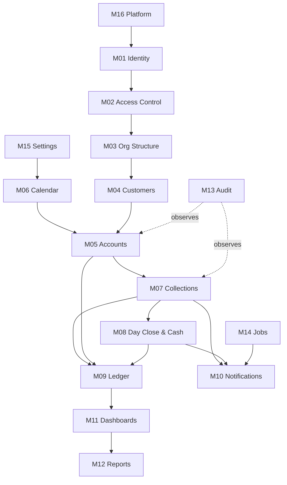
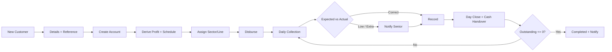

# Product Requirements — Rasi v1

Derived from `reference/Rasi_Application_Product_Documentation_v0.1.pdf`. Where this document and the PDF differ, this document wins — the differences are the ambiguities resolved in [`business-rules.md`](business-rules.md).

Read [`../00-overview/glossary.md`](../00-overview/glossary.md) first. The vocabulary is precise and several terms are narrower than they look.

---

## Scope statement

Rasi v1 replaces the Google Sheet and controls the cash chain. It covers the full lifecycle of a daily-collection account — onboarding, disbursement, daily collection, cash handover, completion — plus the dashboards, alerts and reports the four roles need to run it.

**In scope:** the sixteen modules below.
**Out of scope:** everything listed in [`../00-overview/vision.md`](../00-overview/vision.md#deliberately-not-in-v1).

---

## Modules

Each module has its own specification in [`modules/`](modules/). They are numbered `M01`–`M16` and referenced by number throughout the documentation set.

| # | Module | One-line scope | Spec |
| --- | --- | --- | --- |
| M01 | Identity | Sign-in, sessions, credentials, staff profiles | [M01](modules/M01-identity.md) |
| M02 | Access Control | Four roles, permissions, line/customer data scoping | [M02](modules/M02-access-control.md) |
| M03 | Org Structure | Sectors, lines, historical staff assignments | [M03](modules/M03-org-structure.md) |
| M04 | Customers | Profiles, references, customer 360 | [M04](modules/M04-customers.md) |
| M05 | Accounts | Creation, derivation, schedule, lifecycle, completion | [M05](modules/M05-accounts.md) |
| M06 | Working Calendar | Sundays, holidays, working-day arithmetic | [M06](modules/M06-working-calendar.md) |
| M07 | Collections | Entry, variance, offline sync, corrections | [M07](modules/M07-collections.md) |
| M08 | Day Close & Cash | Line tally, denomination counts, handovers | [M08](modules/M08-day-close-cash.md) |
| M09 | Ledger | Double-entry postings, balances, profit recognition | [M09](modules/M09-ledger.md) |
| M10 | Notifications | In-app centre, Web Push + FCM dispatch | [M10](modules/M10-notifications.md) |
| M11 | Dashboards | Rollups across the four levels | [M11](modules/M11-dashboards.md) |
| M12 | Reports | Line, sector, collection and investment reporting | [M12](modules/M12-reports.md) |
| M13 | Audit | Immutable trail of who changed what | [M13](modules/M13-audit.md) |
| M14 | Jobs | Scheduled work, queues, retries | [M14](modules/M14-jobs.md) |
| M15 | Settings | Business settings and feature flags | [M15](modules/M15-settings.md) |
| M16 | Platform | Config, logging, errors, health | [M16](modules/M16-platform.md) |

### Dependencies

**Critical path:** `M16 → M01 → M02 → M03 → M04 → M05 → M07`. Nothing of business value exists until a collection can be recorded, and M07 depends on all of it.

**M06 is the quiet risk.** Working-day arithmetic looks trivial and underpins every date in the system — schedule generation, target completion, missed detection, day close. It is specified as a pure library with exhaustive tests, and it should be built early and independently rather than as a helper inside M05.

---

## The main flow

PDF §27, with the resolved rules applied:

The loop exits on **balance**, not on day count (BR-05). This is the single most important difference from the source document.

---

## Non-functional requirements

Driven by PDF §3 (1,000+ customers, 10+ lines) with headroom for growth.

| Area | Requirement | Why this number |
| --- | --- | --- |
| **Scale** | 1,000 active customers, 1,500 accounts, 20 lines, 60 staff | Current scale plus 50% |
| **Daily write volume** | ~1,500 collections/day, concentrated 09:00–18:00 IST | One per active account |
| **Peak** | ~300 writes in the busiest 15 minutes | Route timing clusters |
| **Collection entry (offline)** | Under 100 ms, local, **never blocked by network** | The Junior is standing at a door |
| **Collection sync** | Under 500 ms p95 once connectivity returns | |
| **Dashboard load** | Under 2 s p95 for the Super Admin overview | Computed live in v1; snapshots only if this breaks |
| **Route screen load** | Under 1 s, and fully functional from cache offline | |
| **Availability** | 99.5% during 08:00–20:00 IST | Outside these hours, batch windows are acceptable |
| **Data durability** | Zero tolerance for lost collections. Point-in-time recovery, 30-day retention | A lost collection is lost money and a disputed customer note |
| **Offline window** | A device must hold a full day's route and its collections for 72 hours | Covers a weekend outage |
| **Audit retention** | 7 years | Financial record-keeping |
| **Browser support** | Chrome/Android last 2 versions (field), modern evergreen desktop (office) | Service workers and Background Sync are required |

**Security requirements** are specified in [`../02-architecture/security.md`](../02-architecture/security.md). The load-bearing one: **data scoping is enforced server-side**, never by hiding UI. A Junior who crafts a request for another line's customer is refused by the API.

---

## Release gates

v1 is not shippable until all of these hold:

1. A Junior can complete a full route offline and every collection syncs exactly once.
2. The ledger balances — debits equal credits — after a simulated month of activity including corrections and reversals.
3. `account_loan.collectedAmount` reconciles to the ledger for every account.
4. A line can close, hand over cash, and tally to zero discrepancy.
5. Every role sees only its permitted data, verified by API-level tests, not UI inspection.
6. A mid-term account can be created with a past disbursement date and a collected-to-date balance, and behaves identically to one created from day zero.

> Gate 6 exists because every customer entered at launch is already mid-account. There is no data import — staff type them in, each partway through their term. If an account created on day 47 computes its target date or its schedule differently from one created on day 1, every imported customer is wrong from the first morning.

**Hosting, backups and release process are deferred** until the application is built. Two of those decisions constrain the product and are recorded now rather than later: the offline app **requires HTTPS** to register a service worker, and web and API **must share one origin** for the session cookie the offline replay depends on.

---

## Traceability

Every section of the source PDF maps to a module or document. This table is the coverage check.

| PDF § | Topic | Covered by |
| --- | --- | --- |
| §1 | Product Overview | [vision](../00-overview/vision.md) |
| §2 | Current Business Process | vision, M05, M07 |
| §3 | Business Scale | NFRs above |
| §4 | Application Objectives (12) | All modules — see below |
| §5 | User Roles | M01, M02, [personas](../00-overview/personas.md) |
| §6 | Business Structure | M03 |
| §7 | Customer Management | M04 |
| §8 | Account Creation | M05, BR-01 |
| §9 | Investment and Profit | M05, M09, BR-18 |
| §10 | Daily Collection | M07 |
| §11 | Collection Calculation | M07, BR-08 |
| §12 | Collection Notifications | M10 |
| §13 | 100 Collection Days | M05, M06, BR-02…BR-06 |
| §14 | Line Management | M03, M11, M12 |
| §15 | Senior Assignment | M03 |
| §16 | Junior Assignment | M03 |
| §17 | Super Admin Dashboard | M11 |
| §18 | Sector Overview | M11 |
| §19 | Sector Collection Status | M11 |
| §20 | Line-wise Overview | M11, M12 |
| §21 | Admin Dashboard | M11 |
| §22 | Investment Overview | M09, M12 |
| §23 | Dashboard Calculation Levels | M11 |
| §24 | Notifications Center | M10 |
| §25 | Application Navigation | M02, [navigation-ia](../05-ux/navigation-ia.md) |
| §26 | Role-Based Access | M02, [rbac-matrix](rbac-matrix.md) |
| §27 | Main Business Flow | M04, M05, M07 — diagram above |
| §28 | Problems Solved | vision |
| §29 | Key Product Principle | vision, personas |
| §30 | Version 0.1 Scope | [roadmap](../06-delivery/roadmap.md) |
| §31 | Next Documentation Level | [screen-specs](../05-ux/screen-specs.md) |
| App. A | Role Access Summary | [rbac-matrix](rbac-matrix.md) |

### Objectives coverage (§4)

| # | Objective | Module |
| --- | --- | --- |
| 1 | Manage all customers in one place | M04 |
| 2 | Manage sectors and collection lines | M03 |
| 3 | Assign seniors and juniors | M03 |
| 4 | Track daily customer collections | M07 |
| 5 | Identify low and extra collections automatically | M07, BR-08 |
| 6 | Notify seniors about important changes | M10 |
| 7 | Track account completion | M05, BR-05 |
| 8 | Calculate the 100 collection days automatically | M06, BR-04 |
| 9 | Exclude Sundays from collection days | M06, BR-02 |
| 10 | Track investment and profit | M09, BR-18 |
| 11 | Line-wise and sector-wise reports | M12 |
| 12 | Super Admin complete business overview | M11 |

**Coverage: complete.** Three areas go beyond the source document — cash handover (M08), the double-entry ledger (M09) and the audit trail (M13) — because the PDF mentions a "daily tally" without saying who holds the cash or how a figure is proven. Those gaps are the reason for the cash-control scope.
