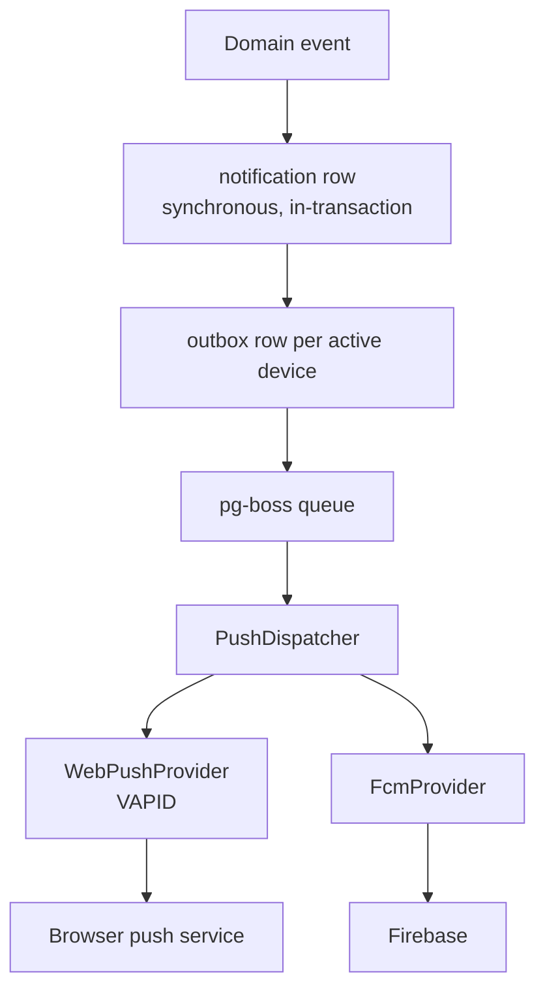

# Notifications Architecture

Two push providers behind one interface, selected by environment variable. Module spec: [M10](../01-product/modules/M10-notifications.md).

---

## Layers



**The notification row is written synchronously, inside the transaction that raised the event. Push dispatch is asynchronous.**

> The in-app centre is the system of record; push is an accelerator. A user whose FCM token went stale must still see their line's discrepancy when they open the app. Conflating delivery with notification would mean a silent token failure silently stops informing someone.

---

## The provider interface

```ts
interface PushProvider {
  readonly name: "WEB_PUSH" | "FCM";
  supports(sub: PushSubscription): boolean;
  send(sub: PushSubscription, payload: PushPayload): Promise<PushResult>;
}

type PushResult =
  | { status: "sent" }
  | { status: "retry"; reason: string }
  | { status: "gone" } // 404/410 — deactivate the subscription
  | { status: "failed"; reason: string };
```

Both providers return the same result type, so retry and deactivation logic lives once in the dispatcher rather than being duplicated per provider.

> `gone` is separated from `failed` deliberately. A `410` means the subscription is permanently dead and retrying is pointless; a transient 5xx means try again. Collapsing them either retries dead subscriptions forever or discards live ones on a blip.

Implemented in `packages/notifications`, framework-free and unit-testable against a fake transport.

---

## Provider selection

```
PUSH_PROVIDER = WEB_PUSH | FCM | BOTH | NONE
```

| Value      | Behaviour                                                                  |
| ---------- | -------------------------------------------------------------------------- |
| `WEB_PUSH` | VAPID only. Subscriptions register as `WEB_PUSH`                           |
| `FCM`      | Firebase only                                                              |
| `BOTH`     | Each subscription dispatches via its own provider — for a migration window |
| `NONE`     | No push. In-app notifications still work. **Development default**          |

The dispatcher routes by `push_subscription.provider`, so a stored subscription always goes to the provider that created it — even under `BOTH`, and even after the env changes.

> Switching providers must not orphan existing subscriptions. Routing by the row rather than by current configuration means a business moving from Web Push to FCM keeps delivering to already-registered devices while new ones register on the new provider.

---

## Web Push (VAPID)

The `web-push` library. VAPID keypair generated once per environment; the public key is served to clients for subscription.

```
VAPID_PUBLIC_KEY
VAPID_PRIVATE_KEY
VAPID_SUBJECT=mailto:ops@example.com
```

Stores `endpoint`, `p256dh`, `auth`. Works on Android Chrome — the field platform — with no Firebase dependency.

**Payload limit ~4 KB.** Rasi sends title, body and a small deep-link payload, well within it.

---

## FCM

Firebase Admin SDK over HTTP v1. Service account credentials from env, never committed.

```
FCM_PROJECT_ID
FCM_CLIENT_EMAIL
FCM_PRIVATE_KEY
```

Stores `fcmToken`. The legacy server-key API is not used — HTTP v1 is the current, supported interface.

---

## One subscription table

Single `push_subscription` table discriminated by `provider`; Web Push columns and the FCM token are nullable and mutually exclusive per row, enforced by a check constraint.

> A table per provider would push provider choice into the schema, making it a migration rather than a configuration change — and every query that reads subscriptions would need to union two shapes.

---

## Delivery and retry

One outbox row **per active subscription**, written in the event's transaction and drained every minute by `dispatch-notifications` rather than a job per notification ([M10 as built](../01-product/modules/M10-notifications.md#as-built)). A user with three devices gets three rows, each retried independently.

| Attempt | Delay     |
| ------- | --------- |
| 1       | immediate |
| 2       | 1 min     |
| 3       | 5 min     |
| 4       | 30 min    |
| 5       | 2 hours   |
| then    | `FAILED`  |

A `gone` result deactivates the subscription immediately and stops retrying. Subscriptions unseen for 90 days are deactivated by a weekly job (M14).

**Push failure never marks the notification unseen.** The two states are independent.

---

## Payload

```json
{
  "title": "Low collection on Line 3",
  "body": "Suresh collected ₹80 of ₹100 from Guru",
  "data": {
    "notificationId": "...",
    "entityType": "collection",
    "entityId": "...",
    "url": "/collections/..."
  }
}
```

**No monetary totals or customer counts beyond what the recipient may already see.** Push payloads land on lock screens; a Junior's device must not display a line total, and notification content respects the same scoping as the API ([rbac-matrix](../01-product/rbac-matrix.md#money-visibility-m09-m11-m12)).

---

## Service worker

The same service worker that handles offline sync also handles push. **As built:** true for the Junior's field app, whose taps open `/route#notifications`; the console registers a separate push-only worker (`public/push-sw.js`, scope `/push/`) because the offline worker is scoped to `/route` ([M10 as built](../01-product/modules/M10-notifications.md#as-built)). `notificationclick` deep-links via `data.url`, focusing an existing tab where one is open rather than opening a duplicate.

---

## What is pushed

Not everything in the notification centre warrants a phone buzz.

| Category      | Pushed                                     |
| ------------- | ------------------------------------------ |
| `ALERT`       | Yes — low, missed, no-payment, discrepancy |
| `WARNING`     | Yes — extra collection, approval requested |
| `SUCCESS`     | **No** — in-app only                       |
| `INFORMATION` | **No** — in-app only                       |

> Pushing every completed account and every new customer would produce dozens of buzzes a day per Senior, and a Senior who silences Rasi stops receiving the low-collection alerts the business needs acted on. `SUCCESS` and `INFORMATION` are things to see when you look, not things to be interrupted for.

`ALERT` cannot be disabled in preferences.

---

## Email

Email is a third channel, beside the centre and push. It is **SMTP through Nodemailer**, so any mail service works without a vendor SDK: a company server, Amazon SES, Brevo, Gmail with an app password, or Mailpit on a laptop. Configuration is in [M10 as built](../01-product/modules/M10-notifications.md#as-built--email-decided-2026-09-15).

**Its own outbox, not `notification_outbox`.** A push row belongs to one device and is deactivated with it; an email has no device. `email_outbox` also carries email that is not a notification: the sign-up welcome, and later verification and password reset. It keeps the same lifecycle (`PENDING` → `SENT` | `FAILED` | `EXPIRED`), the same claim-with-lease dispatch and the same retry table.

**Written in the event's transaction, sent later.** Sending SMTP inside a request would make a collection wait on a mail server, and a timeout could fail the request after the money was recorded. The row is queued with its cause and `dispatch-emails` sends it within a minute.

**Addressed to a user, not an address.** The address is read when the email is sent: a corrected address is used, a deleted user's queue goes with them, and the table holds no copy of anyone's email.

| Category      | Emailed                                                            |
| ------------- | ------------------------------------------------------------------ |
| `ALERT`       | Yes                                                                |
| `WARNING`     | **No** — it fires on every extra collection and correction request |
| `SUCCESS`     | **No**                                                             |
| `INFORMATION` | **No**                                                             |

> An inbox fills faster than a notification tray and is read less often. Only the events the business must act on go there.

**Payload rule.** An email carries the notification's own title and body, already written for that recipient. Nothing is added to it.

---

## Risks

| Risk                            | Mitigation                                                                                                                                |
| ------------------------------- | ----------------------------------------------------------------------------------------------------------------------------------------- |
| Alert fatigue                   | Only `ALERT` and `WARNING` push; exact-match classification; missed detection deferred until after day close                              |
| Stale tokens accumulate         | `gone` deactivation, 90-day staleness job                                                                                                 |
| Provider outage                 | In-app unaffected; outbox retries                                                                                                         |
| VAPID keys lost                 | Documented in the ops runbook; losing them invalidates every subscription and forces re-registration                                      |
| Sensitive data on a lock screen | Payload scoped to the recipient's permissions                                                                                             |
| FCM private key leaked          | Env only, never committed; rotation documented                                                                                            |
| Mail server down or slow        | Email is queued in the transaction and sent by a job; retried with backoff; the notification is in the app regardless                     |
| SMTP password leaked            | Env only (`SMTP_PASS`), never logged — failures log row ids only; use an app password or service credential, not a mailbox's own password |
| Alert emails land in spam       | Send from a domain with SPF, DKIM and DMARC set up at the mail service; a plain-text part in every email                                  |
