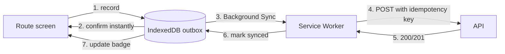

# Offline Sync

**The hardest requirement in v1.** A Junior must be able to record a collection with no connectivity, and that collection must reach the server exactly once.

Rules: BR-13, BR-16a. Stories: [E06](../01-product/user-stories.md#e06--offline-m07).

---

## The requirement

|                    |                                                   |
| ------------------ | ------------------------------------------------- |
| Local save         | Under 100 ms, **never blocked by network**        |
| Route availability | Full route and balances offline for 72 hours      |
| Sync               | Automatic, including while the app is closed      |
| Duplicates         | Impossible, even after ambiguous network outcomes |
| Visibility         | Three distinguishable states, always visible      |

> This is not a progressive enhancement. A Junior in a low-signal area who cannot record a collection has no fallback except paper — which is the system Rasi exists to replace. If offline entry does not work, the product does not work.

---

## Architecture

**The UI writes to IndexedDB and returns. It never awaits the network.** Sync is the service worker's problem, not the collector's.

---

## Local storage

Three IndexedDB stores:

| Store    | Contents                                                   | Lifetime                         |
| -------- | ---------------------------------------------------------- | -------------------------------- |
| `route`  | Today's customers, accounts, expected amounts, outstanding | Refreshed on load, 72-hour TTL   |
| `outbox` | Queued collections awaiting sync                           | Until acknowledged by the server |
| `meta`   | Last sync time, queue depth, session state                 | —                                |

An outbox entry holds the idempotency key, the full request payload, `capturedAt`, attempt count, last error and status.

### Balances update locally

Recording a collection offline decrements the cached outstanding immediately, so the next customer's screen is correct and a second visit the same day shows the right figure.

Local balances are **optimistic and marked as such**. The server's value replaces them on sync.

**Reconciled by key, not by time.** Each route account carries `includedKeys` — the idempotency keys of today's collections its figures already include, read in one repeatable-read snapshot. The device applies a queued or synced entry only when its key is absent. Comparing a sync time with the route's fetch time is not enough: a refresh can land after the server committed but before the device heard back, and the collection would be subtracted twice.

---

## Idempotency

The single mechanism preventing duplicates (BR-13).

**The key is a UUID v4 generated at the moment of recording** — when the Junior taps confirm, before any network attempt — and stored with the outbox entry. Every retry of that entry carries the same key.

> Generating the key at send time instead means a retry after an ambiguous outcome carries a _new_ key, which is precisely the duplicate the mechanism exists to prevent. This is the most common way idempotency implementations fail, and it is worth being explicit about.

Server side:

- `UNIQUE` constraint on `collection.idempotencyKey` — the enforcement point
- A replayed key returns the **original response with `200`**, not a conflict

> A duplicate submission is a success, not a failure. The client needs to know the collection exists; whether this particular request created it is irrelevant. Returning `409` would force the client to interpret an error as a success, which is how "successful" retries end up marked as failures in the UI.

Application-level duplicate checks are not sufficient — they cannot be made race-free against concurrent replays from the same device. The constraint is the guarantee; `idempotency_key` stores the response body so the replay is byte-identical.

---

## Sync

**Primary: Background Sync API.** The service worker registers a sync event on enqueue; the browser fires it when connectivity returns, **even if the app is closed**.

**Fallbacks, because Background Sync is not universal:**

1. Drain on service worker startup
2. Drain on `online` event
3. Drain on app foreground
4. Periodic check while the app is open

> Relying on Background Sync alone would strand collections on any browser lacking it. The fallbacks are not redundancy for rare cases; they are the primary path on some devices.

**Ordering:** collections drain in `capturedAt` order. Per-entity ordering matters — two collections against the same account must apply in the order they were taken, or the balance path differs even though the total is the same.

**Failures are isolated.** One entry failing does not block the rest. Retries use exponential backoff (2s, 4s, 8s… capped at 5 minutes).

| Server response  | Outbox action                                               |
| ---------------- | ----------------------------------------------------------- |
| `2xx`            | Mark synced, remove                                         |
| `4xx` validation | Mark failed, surface to the Junior — retrying will not help |
| `401`            | Pause queue, prompt sign-in, **retain entries**             |
| `5xx` / network  | Retry with backoff                                          |

> A `401` must never discard the queue. Losing a day's collections because a session lapsed is the worst possible failure, and it is entirely avoidable.

---

## Status visibility

Three states, never conflated:

| State           | Meaning             | Indicator                    |
| --------------- | ------------------- | ---------------------------- |
| Saved on device | In the outbox       | Amber dot, "saved on phone"  |
| Syncing         | In flight           | Spinner on the row           |
| Synced          | Server-acknowledged | Green tick, "sent to office" |

Plus a persistent offline indicator and an **always-visible unsynced count**.

> The Junior must be able to answer "is my day safe" at a glance. An optimistic UI that implies everything is sent is worse than no indicator at all — it hides the exact problem the Junior needs to act on by finding signal.

**Sign-out is blocked while the queue is non-empty**, with a warning. Local data dies with the session: sign-out clears the route, the cached identity and sent entries, in the same transaction that re-checks the queue is empty.

A **refused** (4xx) entry counts as unsent, because the office does not have the money. The Junior clears it only by confirming they will hand the money in; nothing still on its way can be cleared. Without this, one refusal would block sign-out on that phone for ever.

---

## Queue limits

| Threshold    | Behaviour                           |
| ------------ | ----------------------------------- |
| 100 unsynced | Warning banner: find connectivity   |
| 300 unsynced | Block new entries, instruct to sync |

A hard limit is unpleasant but better than silent storage-quota eviction, which would lose collections with no warning at all.

---

## Conflict handling

Genuine conflicts are rare, because collections are **append-only and additive** — there is no field-level merge problem, since nothing is edited.

| Situation                          | Resolution                                                 |
| ---------------------------------- | ---------------------------------------------------------- |
| Account completed while offline    | Server rejects with a domain error; surfaced to the Junior |
| Customer transferred while offline | **Accepted** on the line they were on that date (US-023)   |
| Day closed before sync             | **Accepted**, day reopens (BR-16a)                         |
| Same collection replayed           | Idempotency key deduplicates                               |

> **Changed 2026-09-20 (US-023).** A transfer used to be listed here as a refusal: the Junior’s scope was judged by the customer’s current line, so a collection taken at the door before the transfer was rejected when the phone finally synced. That is money already in the Junior’s hand, with paper the only fallback — the very failure this document exists to prevent. The collection path now asks which line the customer was on **on that collection’s business date** (`customer_line_period`, M04), and attributes it there (BR-15). Only a date after the customer left the line is refused.

> Append-only is what makes this tractable. A design where offline edits modify existing records would need field-level merge rules and last-write-wins arbitration — which for money is a data-loss generator.

---

## A correction needs signal, a collection does not

Recording money at the door works with no network at all (US-050); **asking for it to be corrected does not** (US-044, 2026-09-20). A correction is a request to a person: a Senior sees it, decides it, and only then does an account move (BR-14). Queued on a phone it would be an approval nobody knows is waiting, and the Junior would believe the figure was already fixed.

So `/route#correct` says plainly that it needs signal, and says in the same breath that collections still save without it — the one sentence that keeps the distinction from reading as a failure.

---

## Service worker scope

Scoped to the Junior's routes only. The admin console is not burdened with offline machinery it never uses, and a service worker bug cannot affect Admin screens.

**Update strategy:** new versions activate on next launch, never mid-session.

> A service worker updating while a Junior is mid-route could swap the outbox implementation underneath queued entries. The outbox schema is versioned, and migrations run on activation before any drain.

---

## Testing

Highest-risk area in the project; tested accordingly.

| Test                                        | Method                                                    |
| ------------------------------------------- | --------------------------------------------------------- |
| Full route offline, all entries survive     | Playwright with network disabled                          |
| Replay after ambiguous outcome              | Server processes, response dropped, client retries        |
| Concurrent replay of the same key           | Parallel requests, assert one row                         |
| Queue survives app close and device restart | Playwright with browser restart                           |
| `401` mid-sync retains the queue            | Session invalidated during drain                          |
| Ordering per account                        | Multiple collections, verify application order            |
| Quota exhaustion                            | Fill storage, assert the hard limit fires before eviction |

---

## As built

In `apps/web/lib/offline/` (`db.ts`, `outbox.ts`, `drain.ts`, `client.ts`) and `apps/web/app/sw.ts`. Status is in the [backlog](../06-delivery/backlog.md).

- **Service worker:** Serwist (`@serwist/turbopack`), served by the route handler `/serwist/sw.js` and registered with scope `/route`. It precaches the build and uses Serwist's default runtime caching, except `/api/*`, which is network-only: the route lives in IndexedDB, and a network-first API cache would delay the offline fallback by its timeout. Offline works only in a production build — Serwist's defaults are network-only under `next dev`.
- **Drain triggers:** the worker drains on `sync`, `activate`, a `drain` message and start-up. The page drains on start-up, `online` and returning to the foreground **ignoring backoff** (something changed, so send now), and every 60 seconds respecting it. Each request times out after 15 seconds, so a hanging connection cannot hold the Web Lock. Before releasing the lock a drain looks again and sends what was saved while it ran (a Junior confirming a customer's second account a second after the first); a drain that finds the lock taken waits for the holder to finish and drains once more, so the screen never refreshes before the running drain has written what it sent.
- **Reachability, not `navigator.onLine`:** it is true on mobile data with no internet. The indicator shows Offline when the last route refresh could not reach the API.
- **Browser quirks found:** `navigator.serviceWorker.ready` never resolves for a page reached by client-side navigation from outside the scope (`/sign-in` → `/route`), so the registration is looked up with `getRegistration("/route")`. Next.js rewrites are fixed at build time.
- **Tests:** Vitest with `fake-indexeddb` for the engine (`pnpm --filter web test`); `apps/offline-e2e` drives Chrome against a production build and the real API, and **writes permanent rows** (as does its regression journey, `test:regression`, which drives the Junior's route online as part of a whole business day). Under Playwright's offline emulation a page with a service worker keeps `navigator.onLine` true and receives no `online` event, so the suite dispatches it.
- **Not yet proven:** Background Sync firing with the app closed, quota exhaustion, concurrent replay from two contexts, and any real device.

---

## Risks

| Risk                                 | Mitigation                                                                                                |
| ------------------------------------ | --------------------------------------------------------------------------------------------------------- |
| **Collections lost**                 | IndexedDB persistence, queue retained on auth failure, sign-out blocked, hard cap before quota eviction   |
| **Duplicates created**               | Key generated at record time; unique constraint; replay returns original                                  |
| Background Sync unsupported          | Four fallback drain triggers                                                                              |
| Storage quota evicted by the browser | Persistent storage requested; hard cap; warning at 100                                                    |
| Device clock wrong                   | `capturedAt` validated against a plausible window, flagged if wildly divergent; `syncedAt` is server time |
| Service worker update mid-route      | Activation deferred to next launch; versioned outbox schema                                               |
