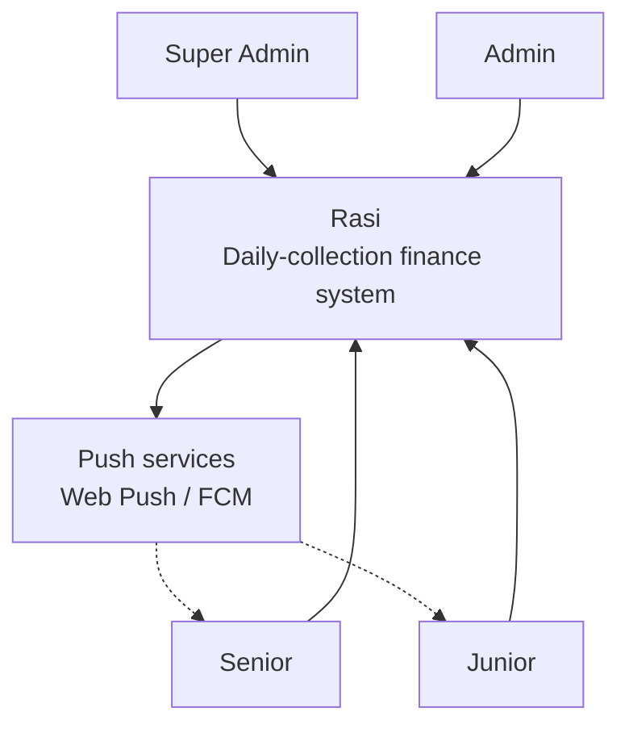
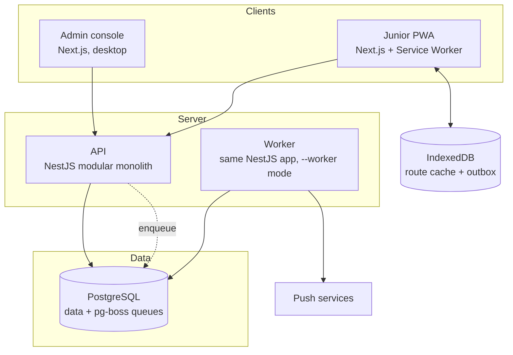
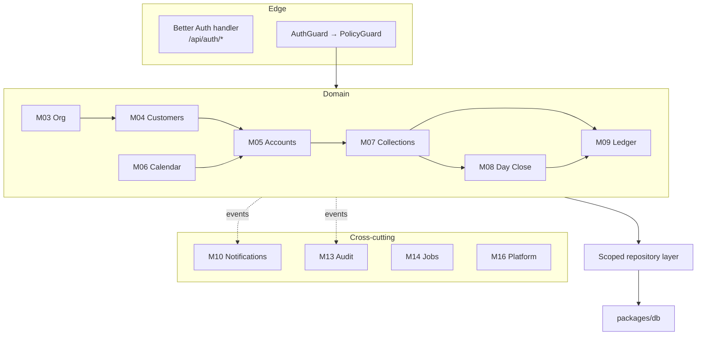

# System Architecture

C4 model — context, container, component — plus deployment. Decisions with alternatives are recorded as [ADRs](adr/).

> **This describes the target.** Of what follows, only the two app shells and the shared config packages exist today. What is actually in the repository is in [`project-structure.md`](../04-engineering/project-structure.md).

---

## Level 1 — Context



**One external dependency.** Rasi talks to push services and nothing else — no payment gateway, no SMS provider, no accounting integration in v1. Customers are not users and do not appear here (see [personas](../00-overview/personas.md#not-a-persona-the-customer)).

> The small external surface is deliberate. A cash business with an offline field requirement has enough hard problems; every integration adds a failure mode that a Junior at a door cannot work around.

---

## Level 2 — Containers



| Container     | Technology                      | Responsibility                                             | Today               |
| ------------- | ------------------------------- | ---------------------------------------------------------- | ------------------- |
| Admin console | Next.js 16 App Router, React 19 | Super Admin, Admin, Senior. Desktop-first, server-rendered | Shell runs on :3000 |
| Junior PWA    | Next.js + Service Worker        | The route screen. **Offline-first**                        | Not started         |
| API           | NestJS 12 modular monolith, ESM | All business logic, M01–M16                                | Shell runs on :3001 |
| Worker        | Same app, `--worker`            | Scheduled jobs, notification dispatch                      | Not started         |
| PostgreSQL    | Postgres 17.7                   | Application data **and** pg-boss queues                    | Installed, native   |
| IndexedDB     | Browser                         | Cached route, outbox queue                                 | Not started         |

### Both front ends are one Next.js application

`apps/web` serves the admin console and the Junior PWA from one deployment, routed by role.

> Two separate front-end applications would duplicate the auth client, the API client, the design system and the build pipeline, to serve four roles from one organisation who share most of their data model. Route-level code splitting gives the Junior a small bundle without a second application to maintain.
>
> The service worker is scoped to the Junior's routes, so the admin console is not burdened with offline machinery it never uses.

### Postgres is also the queue

No Redis. pg-boss stores queues in the same database ([ADR-0004](adr/0004-pg-boss-over-redis.md)).

> One datastore means one backup, one point-in-time recovery, one connection story — and a job can be enqueued **in the same transaction** as the change that triggers it. A notification job enqueued transactionally cannot fire for a collection that rolled back. At ~1,500 collections a day, throughput is not the constraint; correctness is.

### The worker is the same application

Not a third app — `apps/api` booted with `--worker` ([ADR-0003](adr/0003-worker-in-api-process.md)). Separate at runtime, unified at build.

---

## Level 3 — Components (API)



**Three structural rules:**

1. **All data access passes through the scoped repository layer.** Scoping predicates are injected where queries are built, so an unscoped query must be written deliberately rather than obtained by forgetting (M02).
2. **Cross-module communication is by domain event**, not direct service calls, wherever the relationship is a reaction rather than a dependency. Audit coverage becomes a property of the event bus rather than a discipline each module must remember.
3. **`packages/domain` holds the money maths with zero framework imports.** Schedule generation, working-day arithmetic, variance classification and profit apportionment are pure functions, testable exhaustively without a database.

---

## Repository shape

Turborepo workspace, pnpm, Node 24. Packages are named `@repo/*`. **✓ exists · ○ planned.**

```
rasi/
├─ apps/
│  ├─ api/               ✓ NestJS — M01–M16, boots as API or worker
│  └─ web/               ✓ Next.js — admin console + Junior PWA
├─ packages/
│  ├─ db/                ○ Prisma schema, migrations, seed. Sole schema owner
│  ├─ contracts/         ○ Zod schemas + ts-rest contract, shared both ways
│  ├─ domain/            ○ Pure calculation logic. No framework imports
│  ├─ notifications/     ○ Web Push + FCM adapters behind one interface
│  ├─ ui/                ✓ Shared components — three starter components so far
│  ├─ eslint-config/     ✓ Flat-config presets: base, next, react-internal
│  └─ typescript-config/ ✓ tsconfig presets: base, nextjs, react-library
└─ docs/                 ✓
```

The lint and tsconfig presets are **two packages, not one `config/` package** — that is how the workspace was scaffolded, and splitting them keeps a Tailwind preset from pulling ESLint into a package that only needs types. Per-package versions and scripts are in [`project-structure.md`](../04-engineering/project-structure.md#toolchain).

**`packages/contracts` is the type seam.** A Zod contract consumed by both NestJS and Next.js gives end-to-end type safety with no codegen step, while still producing a real REST API — which the offline outbox needs, since it replays plain HTTP requests from a service worker ([ADR-0002](adr/0002-ts-rest-api-contract.md)).

---

## Request paths

**Online collection entry**

```
PWA → POST /collections (idempotency key)
      → AuthGuard → PolicyGuard (scope: assigned customer?)
      → BEGIN
          insert collection
          update account balances
          insert ledger entries
          insert notification
          enqueue push job
        COMMIT
      → 201
```

**Offline collection entry**

```
PWA → IndexedDB outbox (< 100 ms, no network)
      → UI confirms "saved on device"
      ... connectivity returns ...
      → Background Sync drains queue
      → same server path as above, idempotency key deduplicates
      → UI marks "synced"
```

The Junior's path never blocks on the network. That constraint shapes the entire front-end architecture ([`offline-sync.md`](offline-sync.md)).

---

## Runtime

**Hosting is not decided.** Deployment and backups are deferred until the application is built. Development runs everything on one machine, with PostgreSQL installed natively — **no Docker**.

```
localhost
├─ apps/web      :3000    Next.js              ✓ running
├─ apps/api      :3001    NestJS (WORKER_ENABLED=true → same process)   ✓ running, port from PORT
└─ PostgreSQL    :5432    rasi_dev — schemas: public (dev), test (harness)
```

`pnpm dev` starts both apps today. The api validates its configuration at startup and listens on `PORT` (default 3001); see [M16](../01-product/modules/M16-platform.md#as-built).

The architecture deliberately does not assume a deployment shape. API and worker are **separate processes from one codebase** ([ADR-0003](adr/0003-worker-in-api-process.md)), which runs equally well as two PM2 processes, two systemd units, or two containers. Nothing here needs revisiting when the hosting decision is made.

### Two constraints that are not free choices

These are architectural, not operational, and must hold whatever the eventual hosting:

**HTTPS is mandatory.** A service worker will not register over plain HTTP, so **the Junior's offline app does not function without TLS**. This is not a hardening step to add later; it is a precondition for the core feature.

**Web and API must share one origin** — `/` to Next.js, `/api` to NestJS, behind one reverse proxy.

> Same-origin keeps the Better Auth session on a first-party cookie. Third-party cookie restrictions are tightening across browsers, and the Junior PWA replaying queued requests from a service worker is exactly the context where a cross-site cookie fails quietly and inexplicably. The dev environment's split ports are the exception, gated by `NODE_ENV`, and must not become the production shape.

**Backups will be the last line of defence** for a business whose complete financial record is one PostgreSQL database. Deferred, but not optional — one of the decisions to make before going live.

---

## Quality attributes

| Attribute                  | How the architecture serves it                                                            |
| -------------------------- | ----------------------------------------------------------------------------------------- |
| **Offline resilience**     | IndexedDB outbox, Background Sync, idempotency keys, cached route                         |
| **Money correctness**      | Append-only records, double-entry ledger, DB-enforced balancing, same-transaction posting |
| **Auditability**           | Event-driven audit, append-only collections, 7-year retention                             |
| **Scope safety**           | Repository-level predicates, API-level tests for every matrix cell                        |
| **Operational simplicity** | One datastore, no containers, no external services beyond push                            |
| **Deployment-agnostic**    | Nothing assumes a hosting shape; the process split works under any supervisor             |
| **Testability**            | Pure domain package; framework-free money logic                                           |

---

## What is deliberately absent

| Absent                      | Why                                                                                                                        |
| --------------------------- | -------------------------------------------------------------------------------------------------------------------------- |
| Microservices               | One team, one business, ~60 users. A monolith with enforced module boundaries gives the structure without the distribution |
| Redis                       | Postgres covers queueing; caching is not yet needed ([ADR-0004](adr/0004-pg-boss-over-redis.md))                           |
| Separate reporting store    | Reports and dashboards read the same data. No ETL, no eventual consistency between two answers to the same question        |
| GraphQL                     | REST with a typed contract fits; the offline outbox replays plain HTTP                                                     |
| Docker / Kubernetes         | PostgreSQL and Node run natively. Containers add a layer for a system deployed to one place                                |
| Data import tooling         | No exportable dataset exists behind the current spreadsheet. Customers are onboarded by hand                               |
| Aggregation/snapshot tables | Live computation is within reach at this size; snapshots are the planned response _if_ dashboards degrade (M11)            |
