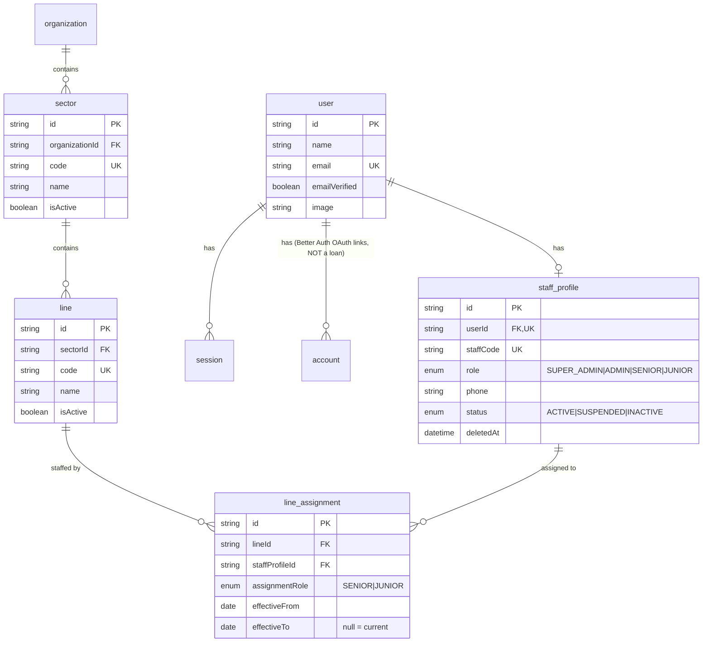
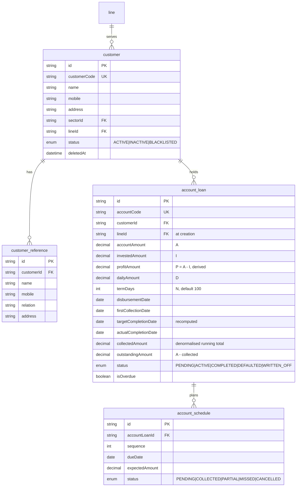
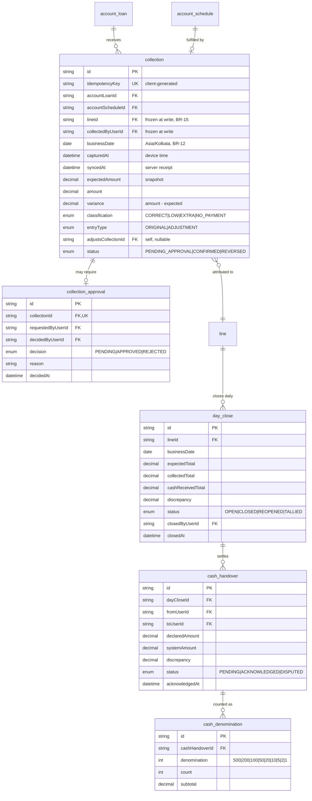
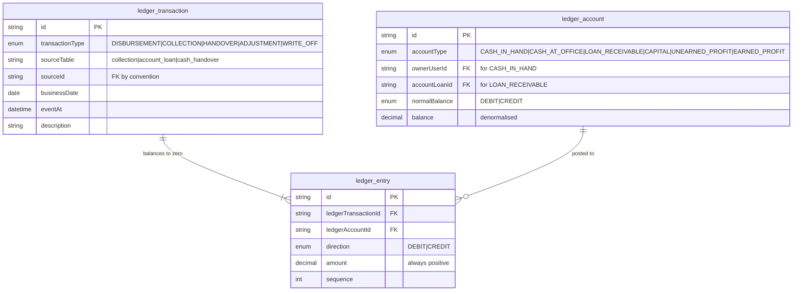
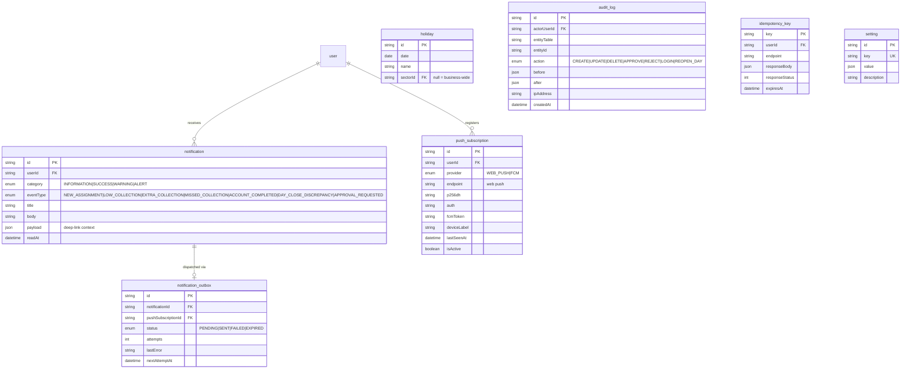

# Entity Relationship Diagram

Presented as five diagrams by subject area rather than one unreadable whole. Column-level detail lives in [`data-dictionary.md`](data-dictionary.md); this document covers structure and the reasoning behind it.

Every rule reference (`BR-nn`) points to [`../01-product/business-rules.md`](../01-product/business-rules.md).

---

## Conventions

- Primary keys are `cuid()` text, except Better Auth's tables which follow its own convention.
- Money is `Decimal @db.Decimal(14,2)` — never float (BR-11).
- `businessDate` is `date`; `capturedAt`/`createdAt` are `timestamptz` (BR-12).
- Every domain table carries `createdAt`, `updatedAt`, and where mutation is meaningful, `createdByUserId`.
- Soft delete (`deletedAt`) applies only to customers and staff. Financial records are never deleted.

> **Naming note.** Better Auth's Prisma schema claims the model name `Account` for OAuth provider links. Rasi's loan entity is therefore `AccountLoan` / table `account_loan`, while remaining **"Account"** in all UI text and documentation. See the [glossary](../00-overview/glossary.md#money).

---

## 1. Identity and organisation

**Why `staff_profile` is separate from `user`.** Better Auth generates and owns `user`, `session`, `account` and `verification`. Those tables must stay untouched so `better-auth generate` can be re-run safely after any version upgrade. All Rasi-specific staff data — role, staff code, phone, status — lives in `staff_profile`, keyed 1:1 to `user.id`.

**Why assignments are historical rather than a column.** `line_assignment` is a temporal record with `effectiveFrom` / `effectiveTo`, not a `currentLineId` field on the staff member. Juniors move between lines often (PDF §16), and a mutable field would make it impossible to answer "who was responsible for Line 3 last March" — which is exactly the question asked when a discrepancy surfaces.

**Constraints.** A line has at most one `SENIOR` assignment with `effectiveTo IS NULL` at any time; enforced by a partial unique index. Juniors have no such limit, but a given staff member has at most one open assignment overall.

---

## 2. Customers and accounts

**`profitAmount` is stored but always derived** (BR-01). Storing it keeps reporting queries simple; a database check constraint (`profitAmount = accountAmount - investedAmount`) guarantees it can never drift from the definition.

**`collectedAmount` and `outstandingAmount` are denormalised caches.** The ledger is the source of truth; these exist because every dashboard and every Junior route screen needs the outstanding figure, and recomputing it from the full collection history on each read does not scale to 1,000 customers. They are updated inside the same transaction as the collection (BR-18), and a nightly reconciliation job verifies them against the ledger and raises an alert on any mismatch.

**`account_schedule` is a regenerable plan, not history.** Under balance-driven completion (BR-05) the uncollected tail is regenerated whenever variance changes the outlook (BR-06). Slots already `COLLECTED` are immutable; only `PENDING` slots are rewritten. This is what keeps `targetCompletionDate` honest without inventing a second projection mechanism.

**Multiple `ACTIVE` accounts per customer are permitted** (BR-01a) — deliberately _no_ constraint restricts this. The structural consequence is that `collection.accountLoanId` is mandatory and never inferred from the customer: a payment always lands on one specific account. Customer-level outstanding is a sum across accounts computed at read time, and is never stored on `customer`.

---

## 3. Collections and cash control

**`collection` is append-only** (BR-14). There is no update path in the API: a correction inserts an `ADJUSTMENT` row pointing at the original via `adjustsCollectionId`, gated by `collection_approval`. The collected total is the sum of all confirmed rows, originals and adjustments together.

**Four fields are deliberately denormalised onto `collection`:** `lineId`, `collectedByUserId`, `expectedAmount` and `businessDate`. Each is a _snapshot of a fact that was true when the money changed hands_. Line attribution must not move when a customer transfers (BR-15); the expected amount cannot be recomputed later because the account has progressed since (BR-08); the business date must be indexable and immune to a future timezone policy change (BR-12).

**`idempotencyKey` is `UNIQUE` and carries the whole offline-safety guarantee** (BR-13). The unique constraint is the enforcement point — not application logic, which cannot be made race-free against concurrent replays from the same device.

**`MISSED` is not a collection status** — it is a schedule-slot status, because a missed visit produces no collection row at all (BR-09).

**Denominations are rows, not JSON.** Nine rows per handover is cheap, and it lets "how many ₹500 notes passed through Line 3 last week" be a query rather than an application-level scan.

---

## 4. Ledger

**Append-only, with no update path at all.** A correction is a new transaction, never a modification. `ledger_entry` has no `updatedAt` because nothing ever updates it.

**Balancing is enforced at the database, not in application code** — a deferred constraint trigger checks that every transaction's debits equal its credits at commit time. Application-level checks are skippable by the next developer in a hurry; a constraint is not.

**`ledger_account.balance` is a cache**, recomputable at any time by summing entries. The nightly reconciliation job rebuilds and compares it, which is also what validates `account_loan.collectedAmount`.

**`sourceTable` + `sourceId` is a deliberate polymorphic reference** without a foreign key, because a transaction may originate from any of several tables. The trade-off is accepted: referential integrity here is guaranteed by the fact that ledger writes only ever happen inside the same transaction as the source row's insert (BR-18).

---

## 5. Notifications, jobs and platform

**One `push_subscription` table covers both providers**, discriminated by `provider`. Web Push uses `endpoint` + `p256dh` + `auth`; FCM uses `fcmToken`. The columns are nullable and mutually exclusive per row, checked by a constraint. This keeps provider selection an env-driven runtime concern (M15) rather than a schema difference.

**`notification` and `notification_outbox` are separate on purpose.** A notification is a fact the user should see — it exists in the in-app centre regardless of push delivery. The outbox is a delivery attempt against one subscription. One notification fans out to every active device a user has registered, each retried independently. Push failure never means the user was not notified.

**`idempotency_key` stores the full original response**, so a replay returns the identical body (BR-13) rather than merely being rejected as a duplicate.

**`audit_log` uses `json` before/after snapshots** rather than per-field rows. Write volume is high and reads are investigative and rare, so a compact append is the right trade-off.

---

## Indexes that matter

The dashboards (PDF §17–§23) and the Junior route screen drive these. They are load-bearing, not optimisation:

| Table              | Index                               | Serves                                                       |
| ------------------ | ----------------------------------- | ------------------------------------------------------------ |
| `collection`       | `(lineId, businessDate)`            | Daily line tally, day close                                  |
| `collection`       | `(accountLoanId, businessDate)`     | Account history                                              |
| `collection`       | `(collectedByUserId, businessDate)` | Per-Junior cash reconciliation                               |
| `collection`       | `UNIQUE (idempotencyKey)`           | Offline replay safety (BR-13)                                |
| `account_schedule` | `(dueDate, status)`                 | Today's expected across the business; `MISSED` detection job |
| `account_loan`     | `(lineId, status)`                  | Line dashboards                                              |
| `account_loan`     | `(status, targetCompletionDate)`    | `OVERDUE` flagging job                                       |
| `line_assignment`  | `(lineId, effectiveTo)`             | Current staffing lookup                                      |
| `ledger_entry`     | `(ledgerAccountId, id)`             | Balance recomputation                                        |
| `notification`     | `(userId, readAt)`                  | Unread badge                                                 |

> Dashboard rollups (`Customer → Line → Sector → Business`) are computed live in v1. At 1,000 customers this is comfortably within Postgres's reach. If the Super Admin dashboard degrades, the first response is a nightly `daily_snapshot` table keyed `(lineId, businessDate)` — **not** a cache layer. That decision is deferred rather than pre-built, and recorded in the roadmap.

---

## Deferred but anticipated

Schema room is left for these without building them:

- **`organization`** has one row per business, created by organization sign-up ([ADR-0012](../02-architecture/adr/0012-organization-sign-up.md)). Every top-level entity carries the key; sector and line codes, setting keys and business-wide holidays are unique within an organization.
- **Phone/PIN login** for field staff — Better Auth's `phoneNumber` plugin adds its own columns to `user`; `staff_profile.phone` is already present.
- **Proof-of-visit** (GPS, photo) — would add `latitude`, `longitude`, `attachmentId` to `collection`. Nullable additions, no restructuring.
- **Digital receipts** — a `receipt_dispatch` table alongside `notification_outbox`, reusing the same retry pattern.
