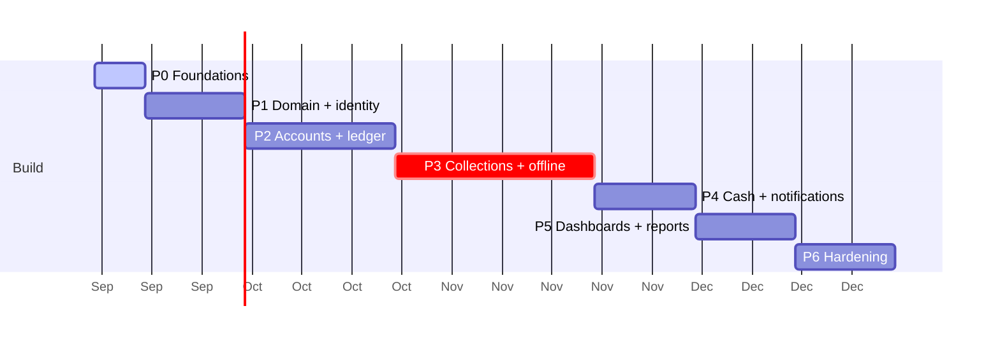

# Roadmap

Six phases to a live v1, then Phase 2. Sequencing follows dependency and risk, not module numbering.

**Estimates assume one or two full-time developers.** They are relative sizing, not commitments.

---

## Sequencing principles

**Risk first, not value first.** Offline sync is the highest-risk work in the project and gets a dedicated phase early. Discovering in month four that the offline model does not hold would invalidate the schema, the API and the day-close design.

**The money rules before anything that uses them.** `packages/domain` — working-day arithmetic, schedule generation, variance, profit apportionment — is built and exhaustively tested before any UI touches it.

**Deployment is not in this plan.** Hosting and backups are deferred until the application is built. Everything below runs on one machine.

---

## Phase 0 — Foundations · ~1 week · **complete**

Turborepo + pnpm workspace, with `apps/web` (Next.js 16, React 19, Tailwind v4) and `apps/api` (NestJS 12, ESM, Vitest) both booting. PostgreSQL 17 — one database, `rasi_dev`, with `public` for development and `test` for the harness. `packages/db` on Prisma 7 carrying the full 28-table schema across two migrations. Better Auth mounted and verified by a real sign-in. `packages/domain` and `packages/contracts` created empty with their boundaries enforced and proven. A two-tier test harness. Tokens and a component base in `@repo/ui`.

The seed dataset is **not** a Phase 0 item — it is a size-L Phase 1 story ([backlog](backlog.md)), and per-story state lives there.

**Exit:** `pnpm dev` runs everything; a user can sign in; `pnpm test` passes against the `test` schema.

> "A user can sign in" means the authentication plumbing works — a Better Auth user gets a session cookie. It does not mean US-001, which additionally requires `staff_profile`, the `ACTIVE` status gate and a `LOGIN` audit entry. Those are Phase 1 and Phase 2.

Current repository detail in [`project-structure.md`](../04-engineering/project-structure.md).

---

## Phase 1 — Domain and identity · ~2 weeks

**`packages/domain` first, and complete** — working calendar (M06), schedule generation, variance classification, profit apportionment, all exhaustively tested including the property tests.

Then M01 Identity, M02 Access Control with repository-level scoping, M03 Org Structure with historical assignments, M16 Platform.

**Exit:** every money rule in [`business-rules.md`](../01-product/business-rules.md) has a passing test with worked examples. Sectors, lines and staff can be managed. Every RBAC matrix cell is tested.

> Building M06 as a standalone, framework-free library first is the single highest-leverage decision in the schedule. An off-by-one in working-day counting produces no error — just wrong completion dates for every account created that day, discovered weeks later.

**⟶ The seed dataset is built here, and it matters more than it looks.** There is no production data to work from and no anonymised copy — the seed is the only dataset anyone will see before launch. It must include the awkward cases from day one (uneven final instalment, overdue account, two concurrent accounts, mid-account line transfer, cash discrepancy, approved correction), because a case that is not seeded is a case nobody looks at until a customer hits it.

---

## Phase 2 — Customers, accounts, ledger · ~3 weeks

M04 Customers, M05 Accounts, M09 Ledger, M13 Audit.

Account creation with live derivation and schedule preview (S-04). Disbursement posting to the ledger. The balancing trigger. Audit trail.

**Exit:** an account can be created and disbursed; the ledger balances; the audit trail records everything; a customer 360 renders including multi-account totals.

---

## Phase 3 — Collections and offline · ~4 weeks

**The riskiest phase.** M07 Collections, plus the entire offline stack.

Collection entry and variance. Idempotency infrastructure. IndexedDB outbox, Background Sync with its four fallbacks, three-state sync UI. The Junior's route screen (S-01, S-02, S-03). Corrections and approvals.

**Exit:** the full [E06 offline suite](../01-product/user-stories.md#e06--offline-m07) passes, including replay-after-ambiguous-outcome and queue-survives-restart — **tested on a real mid-range Android device**, not only an emulator.

> Four weeks for one module because the offline path is genuinely hard and cannot be retrofitted. If this phase slips, everything after it slips — and that is the correct trade, because a collection that fails to record is the one failure the business cannot absorb.

---

## Phase 4 — Cash control and notifications · ~2 weeks

M08 Day Close and Cash, M10 Notifications, M14 Jobs.

Day close, handovers with denomination counts, disputes. Notification centre, Web Push and FCM behind one interface. pg-boss queues, scheduled jobs, nightly reconciliation.

**Exit:** a line closes, hands over cash and tallies to zero. Alerts reach a Senior's phone via both providers. Nightly reconciliation runs and reports.

---

## Phase 5 — Dashboards and reports · ~2 weeks

M11 Dashboards, M12 Reports, M15 Settings.

All four role dashboards with drill-down. The six reports. Settings and holiday management.

**Exit:** every §17–§23 figure renders and drills down; reports are date-bounded and role-scoped.

---

## Phase 6 — Hardening · ~2 weeks

Full E2E suite. Security review against [`security.md`](../02-architecture/security.md). Performance verification against the NFR targets. **Mid-term account verification** — release gate 6. Staff training materials.

**Exit:** all six [release gates](../01-product/prd.md#release-gates) pass. The application is complete and runs correctly on a development machine.

---

## Phase 7 — Deploy and launch · not planned

Hosting, backups and release process are decided **after** Phase 6, by your own decision. Hosting shape, process supervision, TLS, single-origin routing, backups and applying migrations on release are the open items.

Then data entry: 1,000+ customers typed in by hand through the onboarding flow, each already mid-account.

> **Budget this properly — it is days of work by several people, not an afternoon.** There is no importer and none is planned, so every customer is a form: name, mobile, address, reference person, then an account with its amounts, a past disbursement date and a collected-to-date balance.
>
> Two things make it slower than it sounds. The balance must come from what each customer has **actually paid**, not inferred from a day count — any customer who ever underpaid will not match `days × ₹100`. And it happens once, under time pressure, before anyone trusts the system.
>
> This is why the onboarding and account-creation forms are called throughput-critical in the screen specs, and why release gate 6 exists.

---

## Timeline

**~16 weeks to a complete application**, with one or two developers. Deployment and data entry follow, and are not estimated here.

---

## The real risk

**Offline sync (Phase 3).** The highest technical risk in the project, by a distance. Mitigated by dedicating a full phase, building it early enough that a failure is still recoverable, and testing on a real mid-range Android phone rather than an emulator.

> Everything else in this plan is ordinary work. Phase 3 is the part that can fail in a way that is not obvious until a Junior loses a route's worth of collections in the field — which is exactly the failure the project exists to prevent.
> The mitigation that costs nothing: build Phase 3 before Phases 4–6. If the offline model turns out to need rethinking, there is still a project left to rethink it in.

---

## Later (post-launch)

Deferred deliberately, in rough priority order:

| Item                           | Why deferred                                                                                                                                   |
| ------------------------------ | ---------------------------------------------------------------------------------------------------------------------------------------------- |
| **Excel/PDF export**           | Genuinely useful, not on the critical path. Worth building once the ledger has reconciled for a month                                          |
| **Tamil language support**     | Field staff manage in English; worth doing properly rather than quickly                                                                        |
| **Phone + OTP/PIN sign-in**    | Better Auth's `phoneNumber` plugin. Email works for Admin-created accounts                                                                     |
| **GPS + photo proof of visit** | Nullable columns on `collection`; no restructuring                                                                                             |
| **SMS/WhatsApp receipts**      | Replaces the paper collection note — needs care, since that note is currently the customer's only record                                       |
| **Daily snapshot tables**      | Only if dashboards exceed the 2 s target. **Not pre-built**                                                                                    |
| **Two-factor authentication**  | Revisit once phone sign-in exists                                                                                                              |
| **Penetration test**           | Recommended before scaling beyond the current business                                                                                         |
| **Bulk customer entry aid**    | Only if hand-entry at launch proves painful enough to justify it — a CSV paste against the same validation the form uses would be a day's work |

**Explicitly not planned:** a customer-facing app, credit scoring, online payments, accounting-package integration, multi-business tenancy. Reasoning in [`vision.md`](../00-overview/vision.md#deliberately-not-in-v1).
